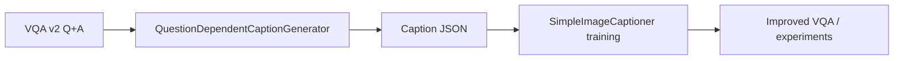
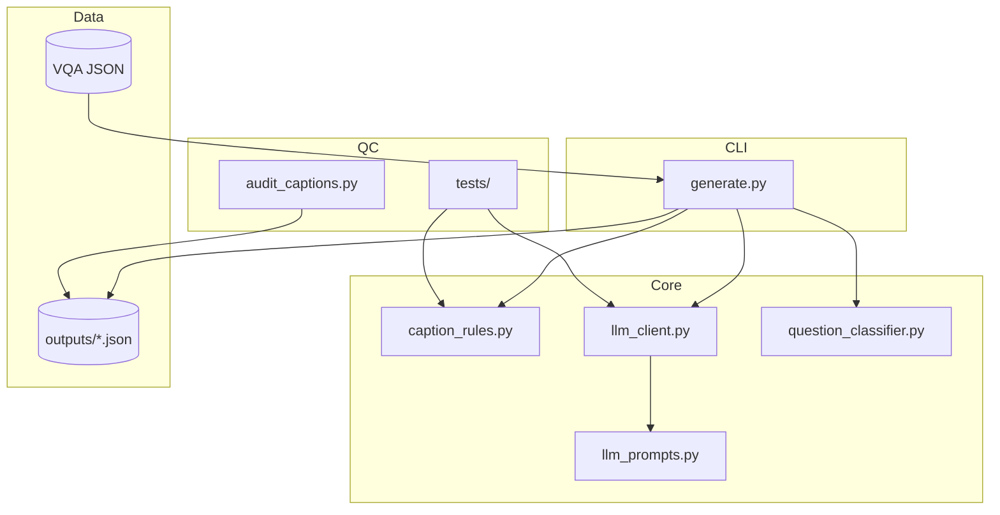
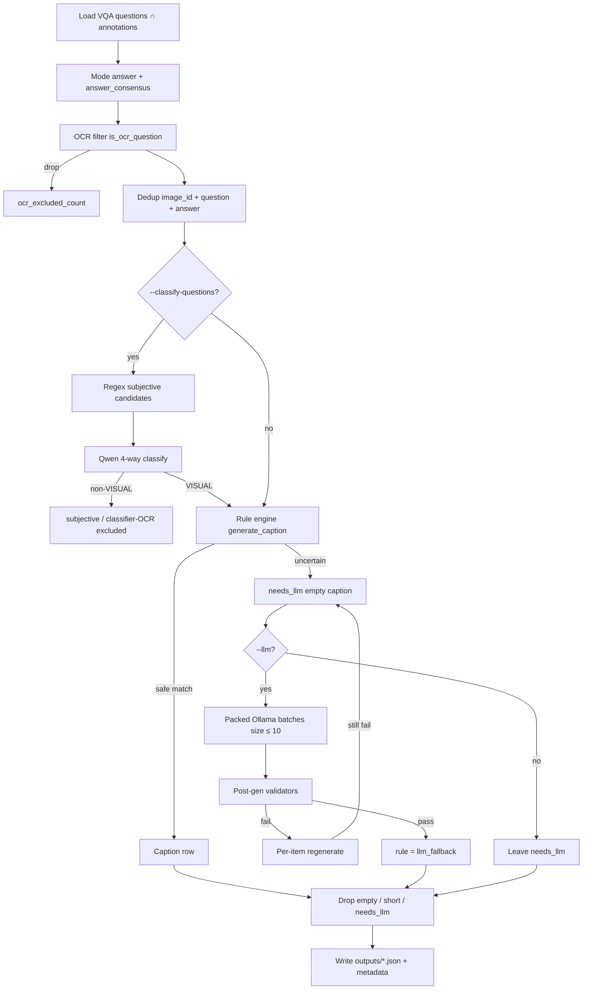
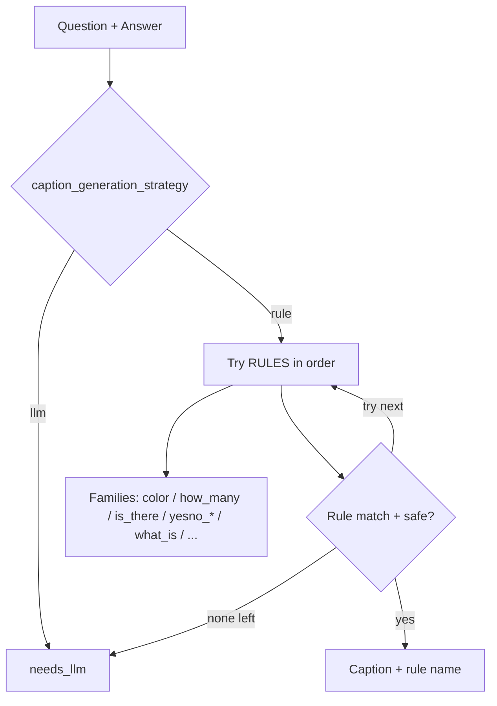
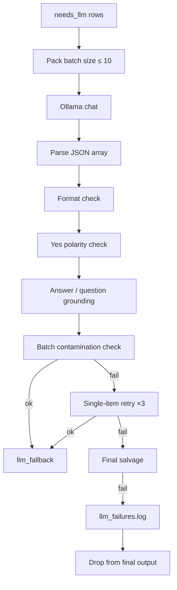
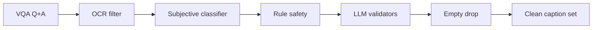

# QuestionDependentCaptionGenerator — Architecture

This document describes the architecture of the **QuestionDependentCaptionGenerator**: a pipeline that turns VQA v2 `(question, answer)` pairs into **question-dependent captions** used as supervision for a visual captioner without OCR.

**Goal:** `(image, question, answer)` → natural declarative sentence, e.g.

| Question | Answer | Caption |
|----------|--------|---------|
| What color is the car? | red | The car is red. |
| Are the animals eating? | yes | The animals are eating. |
| Is there grass? | yes | There is grass. |

**Design principle:** Prefer **high-precision deterministic rules**. Anything uncertain goes to an LLM (Ollama). Rule coverage is not a research goal; clean, reproducible targets are.

---

## 1. Role in the thesis pipeline



The Stage-1 captioner sees pooled visual region features only (no glyph reading). Therefore this generator:

1. **Drops OCR-dependent questions** (signs, websites, letters, logos, …).
2. Produces captions that a non-OCR model can plausibly learn from vision + question context.

---

## 2. Module layout



```
QuestionDependentCaptionGenerator/
├── generate.py              # CLI orchestration + I/O
├── caption_rules.py         # OCR filter + rule engine + routing
├── llm_prompts.py           # Packed batch prompt + few-shots
├── llm_client.py            # Ollama client + validators + retry
├── question_classifier.py   # Subjective/OCR 4-way classifier
├── audit_captions.py        # Post-hoc QC on output JSON
├── tests/                   # Unit tests for known failure cases
├── architecture/            # This documentation
└── outputs/                 # Generated caption JSON (+ failure logs)
```

| Module | Responsibility |
|--------|----------------|
| `generate.py` | Load VQA, run filters/rules/LLM, drop empties, write JSON, resume/checkpoints |
| `caption_rules.py` | `is_ocr_question`, narrow rewrite rules, `generate_caption`, safety gates |
| `llm_prompts.py` | System prompt, few-shots, packed user prompt (`PROMPT_VERSION`) |
| `llm_client.py` | HTTP chat, parse JSON captions, polarity/grounding/contamination checks |
| `question_classifier.py` | Regex candidates → Qwen label: VISUAL / SUBJECTIVE_PERSONAL / COMMONSENSE / OCR |
| `audit_captions.py` | Count residual bugs (`The there`, `made of is`, empty captions, …) |

---

## 3. End-to-end data flow



### Stages (ordered)

1. **Load & mode answer** — Majority of 10 annotators. Store `answer_count` and `answer_consensus` (= count / 10). Consensus is annotator agreement, not model confidence.
2. **OCR exclusion** — Heuristic regex + selected `question_type` prefixes. Removed from rows entirely.
3. **Dedup** — Keep first `(image_id, question, answer)`.
4. **Optional question classifier** — Keyword candidates only; keep `VISUAL`.
5. **Rule engine** — First safe match wins; else `needs_llm`.
6. **Optional LLM fallback** — Packed batches; validate; retry; leftovers stay `needs_llm`.
7. **Hard drop** — Empty / short / `needs_llm` rows never enter the written set (`dropped_empty_count`).

---

## 4. Rule engine design

**Precision over coverage.** No catch-all template rule. Uncertain parses → `needs_llm`.

### Rule decision flow



### Rule families (order matters)

| Family | Examples | Notes |
|--------|----------|-------|
| Attribute | `what_color`, `what_kind_type`, `what_is_doing` | Tight patterns only |
| Existential | `is_there`, `are_there` | Includes bare nouns (`Is there grass?`) |
| Yes/No specialized | `anyone`, `any`, `all`, `both`, `this_a`, possessive, coordinated, modal | Narrow shapes |
| Yes/No general | `yesno_is_are_predicate` | Defers unreliable compound NPs |
| Wh- | `what_is`, `who` | `made of` / `used for` before default |
| Always LLM | Does/Do/Did, complex Is/Are, free-form which/where/… | Via `caption_generation_strategy` |

### Safety net

`can_generate_safe_rule_caption` rejects broken templates such as `The there …`, `The the …`, `… made of is …`, `the answer is …`.

### Routing helpers

| Helper | Effect |
|--------|--------|
| `should_use_llm_for_does_do` | Always LLM |
| `is_complex_is_are_question` | Long / multi-verb / `enough to` / … → LLM |
| `should_use_llm_for_who` | Non-`Who is/are` or messy answers → LLM |
| `caption_generation_strategy` | Top-level `"rule"` vs `"llm"` |

---

## 5. LLM fallback architecture



### Prompts (`llm_prompts.py`)

- Versioned (`PROMPT_VERSION`) for reproducibility.
- One declarative sentence, faithful to the answer, no question echo, no “the answer is”.
- Few-shots + numbered batch → JSON array of captions.

### Validators (`llm_client.py`)

| Check | Rejects |
|-------|---------|
| Format | Empty, &lt;2 words, `?`, brackets/quotes, multi-sentence, “the answer” |
| Yes polarity | `answer=yes` but clear negation (unless question embeds negation) |
| Grounding | Missing answer tokens; yes/no must overlap question content words |
| Spurious negation | Non-yes/no answer but caption invents `no`/`not`/… |
| Contamination | Near-duplicate of another batch caption or better match to another Q+A |

**Default batch size is 10** (larger batches raise cross-item contamination risk).

---

## 6. Filtering layers (quality gates)



| Gate | When | Outcome |
|------|------|---------|
| OCR regex / `question_type` | Always | Remove text-reading questions |
| Subjective classifier | `--classify-questions` | Remove personal / subjective / classifier-OCR |
| Rule safety | Always | Bad templates → LLM or skip |
| LLM validators | `--llm` | Reject / regenerate bad captions |
| Empty drop | Always at write | No empty/`needs_llm` in final annotations |

---

## 7. Output schema

```json
{
  "info": {
    "description": "...",
    "num_samples": 1205,
    "ocr_excluded_count": 75,
    "dropped_empty_count": 676,
    "subjective_excluded_count": 43,
    "classifier_ocr_excluded_count": 0,
    "rule_counts": { "what_color": 181, "llm_fallback": 0 },
    "llm": {
      "model": "qwen2.5:3b-instruct-q4_K_M",
      "batch_size": 10,
      "prompt_version": "...",
      "failure_log": "..."
    },
    "question_classifier": {
      "model": "...",
      "prompt_version": "v1_four_way_visual_filter"
    }
  },
  "annotations": [
    {
      "question_id": 9001,
      "image_id": 9,
      "question": "What color are the dishes?",
      "answer": "pink and yellow",
      "answer_count": 3,
      "answer_consensus": 0.3,
      "caption": "The dishes are pink and yellow.",
      "rule": "what_color"
    }
  ]
}
```

`rule` is a rule name, `llm_fallback`, or (transiently before drop) `needs_llm`.

---

## 8. Operational concerns

| Topic | Behavior |
|-------|----------|
| Resume | Same `--llm` command continues from prior `llm_fallback` captions |
| Checkpoint | Atomic JSON write every N batches; Ctrl+C saves then exits |
| Failure log | `*.json.llm_failures.log` with reason codes |
| Reproducibility | Store model, host, `prompt_version`, batch size, classifier metadata |
| QC audit | `python audit_captions.py outputs/....json` |
| Tests | `python -m unittest tests.test_qc_fixes -v` |

### Recommended pilot before full train (~443k)

```bash
python generate.py --split train --llm --max-items 25000 --batch-size 10 \
  --classify-questions --model qwen2.5:3b-instruct-q4_K_M \
  --checkpoint-every 50 --output outputs/pilot_25k.json
python audit_captions.py outputs/pilot_25k.json
```

Freeze the generator only after manual spot-checks of rule vs LLM samples.

---

## 9. Design rationale (summary)

1. **Rules for certainty, LLM for ambiguity** — avoids systematic grammatical errors from over-eager parsers.
2. **Filters before supervision** — OCR and subjective questions would poison a non-OCR captioner.
3. **Validators after LLM** — prompt restrictions alone do not prevent polarity flips or batch swaps.
4. **Never ship empty targets** — leftover `needs_llm` rows are dropped, not silently trained on.
5. **Metadata for science** — agreement (`answer_consensus`), exclusion counts, and generation settings stay with the dataset for thesis reproducibility.
