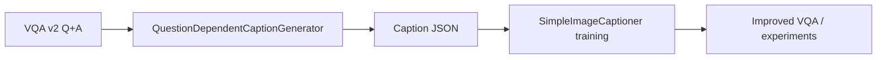
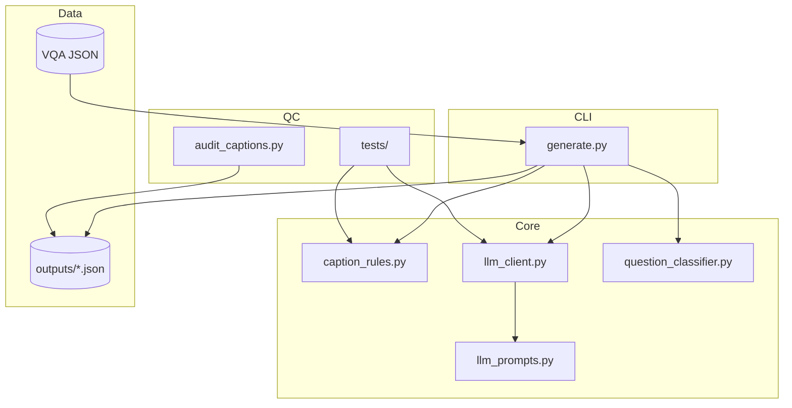
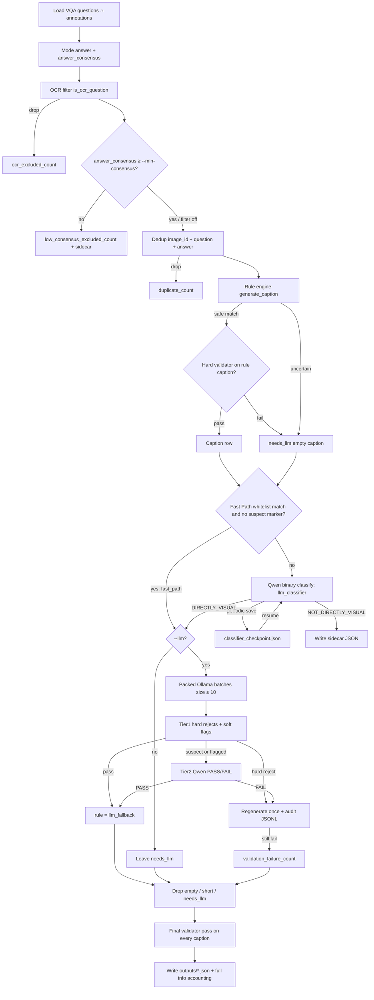
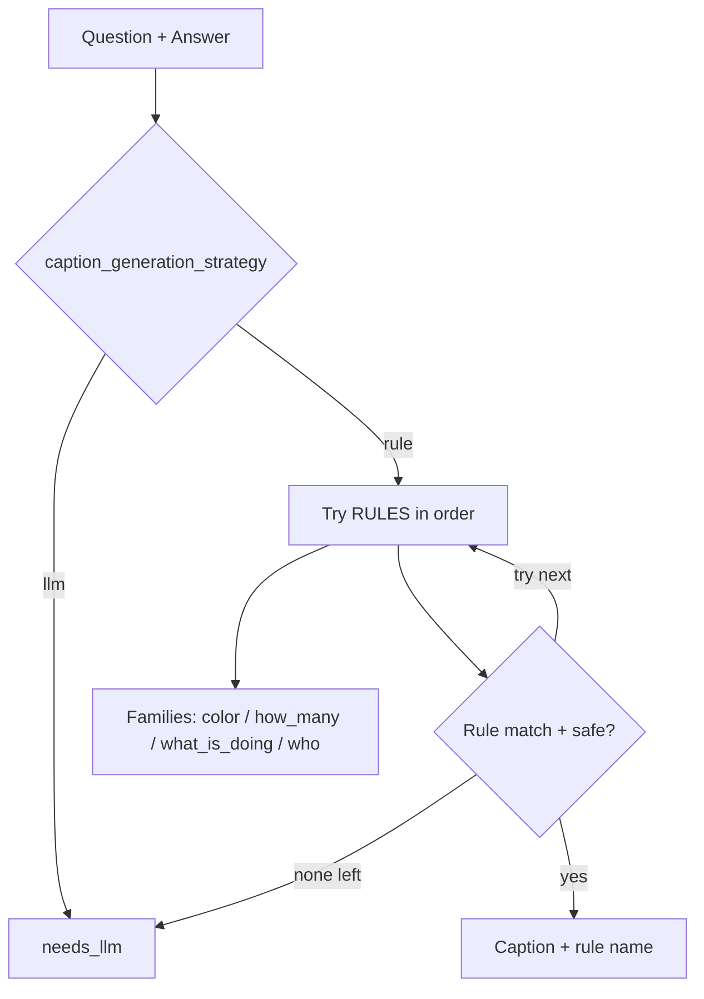
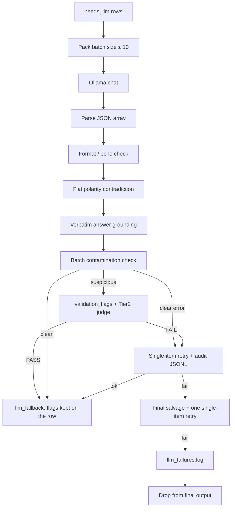

# QuestionDependentCaptionGenerator — Architecture

This document describes the architecture of the **QuestionDependentCaptionGenerator**: a pipeline that turns VQA v2 `(question, answer)` pairs into **question-dependent captions** used as supervision for a visual captioner without OCR.

**Goal:** `(image, question, answer)` → natural declarative sentence, e.g.

| Question | Answer | Caption |
|----------|--------|---------|
| What color is the car? | red | The car is red. |
| Are the animals eating? | yes | The animals are eating. |
| Is there grass? | yes | There is grass. |

**Design principle:** Prefer **high-precision deterministic rules**. Anything uncertain goes to an LLM (Ollama). Rule coverage is not a research goal; clean, reproducible targets are.

---

## 1. Role in the thesis pipeline



The Stage-1 captioner sees pooled visual region features only (no glyph reading). Therefore this generator:

1. **Drops OCR-dependent questions** (signs, websites, letters, logos, …).
2. **Drops questions that are not directly visual** (OCR leftovers, opinion, external knowledge) via the always-on binary classifier.
3. Produces captions that a non-OCR model can plausibly learn from vision + question context.

---

## 2. Module layout



```
QuestionDependentCaptionGenerator/
├── generate.py              # CLI orchestration + I/O
├── caption_rules.py         # OCR filter + rule engine + routing
├── llm_prompts.py           # Packed batch prompt + few-shots
├── llm_client.py            # Ollama client + validators + retry
├── question_classifier.py   # Binary DIRECTLY_VISUAL / NOT_DIRECTLY_VISUAL
├── audit/audit_captions.py  # LLM sample auditor (batched PASS/FAIL + P/R)
├── tests/                   # Unit tests for known failure cases
├── architecture/            # This documentation
└── outputs/                 # Generated caption JSON (+ failure logs + sidecar)
```

| Module | Responsibility |
|--------|----------------|
| `generate.py` | Load VQA, run filters/rules/LLM, drop empties, write JSON, resume/checkpoints |
| `caption_rules.py` | `is_ocr_question`, narrow rewrite rules, `generate_caption`, safety gates |
| `llm_prompts.py` | System prompt, few-shots, packed user prompt (`PROMPT_VERSION`) |
| `llm_client.py` | HTTP chat, parse JSON captions, Tier-1 lexical + Tier-2 semantic judge |
| `question_classifier.py` | `DIRECTLY_VISUAL` / `NOT_DIRECTLY_VISUAL` with a conservative Fast Path whitelist (colour / count / existence / spatial / animal|sport|room|food|… / do-you-see / doing|holding|wearing); everything else goes to the LLM (prompt `v8_visual_inference_default`) and every row records `visual_filter_source` |
| `audit/audit_captions.py` | Sample `k` captions; batched Ollama PASS/FAIL audit |

---

## 3. End-to-end data flow



### Stages (ordered)

1. **Load & mode answer** — Majority of 10 annotators. Store `answer_count` and `answer_consensus`. Low-consensus rows are **kept** unless `--min-consensus` is set.
2. **OCR exclusion** — Heuristic regex + selected `question_type` prefixes.
3. **Optional consensus filter** — `--min-consensus T` (default `0.0` = off) drops pairs whose mode answer got less than `T` annotator agreement: if humans cannot agree, the caption is not a trustworthy training target. Runs **before** dedup so a dropped pair does not occupy the dedup slot. Drops go to `*_low_consensus.json`; count in `info.low_consensus_excluded_count`. On VQA v2 train ~11% of pairs sit below `0.4` and all of them are non-yes/no (a binary answer over 10 annotators cannot fall below `0.5`), so the filter raises the yes/no share of the dataset.
4. **Dedup** — Keep first `(image_id, question, answer)`; store `duplicate_count`.
5. **Rule engine** — First safe match wins; else `needs_llm`. Remaining families: `what_color`, `how_many`, `what_is_doing`, `who`. Every rule caption then goes through the same hard validator as an LLM caption: a failure becomes `needs_llm` (`info.rule_validation_reject_count`) instead of shipping a broken template.
6. **Binary classifier (always on)** — Fast Path is a **whitelist**, not a default: a question skips the LLM only when it matches `_FAST_PATH_VISUAL_RE` (colour incl. plurals; `how many` / `number of`; `is/are there`; `do/can you see`; `is the sky`; `what animal(s)|shape|sport|game|activity|room|scene|place|food(s)|fruit(s)|dish`; `what is under/over/…`; plain end-anchored spatial `Is the cat on the table?`; end-anchored `what … doing|holding|wearing`) **and** carries no `_NON_VISUAL_SUSPECT_RE` marker. Not whitelisted (UNKNOWN → LLM): bare `what is/are/do/does`, `what kind/type`, `is he/she`, `where is`, `could this`, `does this look`, `who is`, …. Everything else goes to Qwen (`v8_visual_inference_default`). `--no-fast-path` disables the whitelist entirely so every question is classified by the LLM. Each row records `visual_filter_source` (`fast_path` / `llm_classifier`), including the rows written to `*_not_directly_visual.json`. Incremental checkpoint (`*_classifier_checkpoint.json`) every `--classifier-checkpoint-every N` enables resume after interrupt and is keyed on `fast_path_enabled`, so a Fast Path run cannot resume a `--no-fast-path` run. Ollama is required for this stage even when `--llm` is off.
7. **Optional LLM fallback** — Packed batches; Tier-1 hard rejects then Tier-2 semantic judge; **1** regenerate; salvage rounds also get one single-item retry so a batch parse failure is never dropped untested. Every retry is written to `*_validation_audit.jsonl`.
8. **Hard drop** — Empty / short / `needs_llm` rows never enter the written set.
9. **Final validation pass** — The hard validator runs once more over **all** remaining captions (rule and LLM alike); soft findings are stored as `validation_flags` and the row is kept (`info.validation_flagged_count`).

---

## 4. Rule engine design

**Precision over coverage.** No catch-all template rule. Uncertain parses → `needs_llm`.

### Rule decision flow



### Rule families (order matters)

| Family | Examples | Notes |
|--------|----------|-------|
| Attribute | `what_color`, `what_is_doing` | Tight patterns only |
| Wh- | `who` | Uncertain answers → LLM |
| Count | `how_many` | Two shapes only (`are there` / `are in/on`) |
| Always LLM | Does/Do/Did, all Is/Are/Was/Were, `What kind/type of …`, `Can/Could/Will/Would/Has/Have/Had`, all `What is …?`, free-form which/where/… | Via `caption_generation_strategy` + deleted rules |

### Deleted rules (Comments8)

| Rule | Failure mode | Now |
|------|--------------|-----|
| `yesno_modal_have` | Misplaced the auxiliary: "This photo be could …", "The plane fly will …" | Deleted — always `needs_llm` |
| `what_is` | Too many `What is …?` subtypes need a real parser (`What is it called?`, `What is it for?`, `What is the weather like?`) | Deleted — always `needs_llm` |

`what_is_doing` is a separate rule and is unchanged.

### Deleted rules (Comments9)

| Rule | Failure mode | Now |
|------|--------------|-----|
| `what_kind_type` | Compound kind/type NPs (`birthday celebration` vs identity head `donuts`) need a real parser | Deleted — always `needs_llm` |
| Full Is/Are family (`is_there`, `are_there`, `yesno_is_*` / `yesno_are_*` / `yesno_is_are_*`) | Subject/predicate splits (locative, quantifier, PP leftover) were too fragile | Deleted — always `needs_llm` |

### Safety net

`can_generate_safe_rule_caption` rejects broken templates such as `The there …`, `The the …`, `… made of is …`, `the answer is …`, `with his is not …`.

### Routing helpers

| Helper | Effect |
|--------|--------|
| `should_use_llm_for_does_do` | Always LLM |
| `should_use_llm_for_what_kind_type` | Always LLM for `What kind/type of …` |
| `should_use_llm_for_is_are` | Always LLM for Is/Are/Was/Were |
| `should_use_llm_for_who` | Non-`Who is/are` or messy answers → LLM |
| `caption_generation_strategy` | Top-level `"rule"` vs `"llm"` |

---

## 5. LLM fallback architecture



### Prompts (`llm_prompts.py`)

- Versioned (`PROMPT_VERSION`) for reproducibility.
- One declarative sentence, faithful to the answer, no question echo, no “the answer is”.
- Few-shots + numbered batch → JSON array of captions.

### Validators (`llm_client.py`)

The validator is deliberately split: a regex may only reject what is almost certainly wrong, and everything merely suspicious becomes a flag that a human (or the Tier-2 judge) can review. It runs on **all** captions, rule-based and LLM alike.

**Hard rejects** (regex, high precision)

| Check | Rejects |
|-------|---------|
| Format | Empty, &lt;2 words, `?`, brackets/quotes, multi-sentence, “the answer” |
| Question echo | Caption just repeats the question |
| Yes polarity | `answer=yes` but a clear sentential negation, or a caption opening with “No” (unless the question embeds negation) |
| No polarity | `answer=no` but the caption explicitly says “Yes” |
| Spurious negation | Non-yes/no answer but caption invents a sentential `no`/`not`/… — determiner `no` inside a noun phrase (`a no parking sign`) does not count |
| Grounding | Proper nouns / numbers / colours / short answers must appear **verbatim** (Loon ≠ Loom) |
| Contamination | Near-duplicate of another batch caption or better match to another Q+A |
| Semantic judge | Tier-2 Qwen FAIL → 1 regenerate then drop |

**Soft flags** (`validation_flags`, row is kept)

| Flag | Meaning |
|------|---------|
| `relation_low` | Fewer than **50%** (`RELATION_MIN_RATIO`) of the question's *required* stems survive in the caption. Required = content stems minus the wh-category noun phrase — the answer *replaces* the category word, so these keep: `What **animal** is this?` → `This is a dog.`; `What **season** is it?` → `It is summer outside.`; `What **mode of transportation** is pictured?` → `A car is pictured.` — and minus either/or alternatives (`right **or** left` can only yield one). Depiction verbs (`shown`/`pictured`/`seen`) are stopwords so synonym choice does not flag a correct caption |
| `unsupported_facts_suspect` | Caption adds content words absent from Q+A |
| `no_answer_without_negation` | `answer=no` with no negation word — often a correct paraphrase (`Was this taken during the day?` + no → `It is taken at night.`) |
| `answer_partial_match` | Fewer than 50% of a longer answer's tokens appear in the caption |

Two fixes make this precision possible: `_stem` strips inflection **twice** (so `buildings` and `building` share a stem instead of producing a false relation mismatch), and negation detection ignores determiner `no` inside a noun phrase (`The sign says no parking.` is a positive statement).

**Default batch size is 10.** `single_retries` default is **1**, including the final salvage round.

### Retry audit log

`{stem}_validation_audit.jsonl` records one entry per retried item — `retry_kind` (`validator` vs `generation`), `first_caption`, `failure_reason`, `retry_caption`, `final_result` (`accepted`/`dropped`), `stage` (`main`/`salvage`). Successful retries used to leave no trace beyond the `validation_retry_count` number.

---

## 6. Filtering layers (quality gates)


| Gate | When | Outcome |
|------|------|---------|
| OCR regex / `question_type` | Always | Remove text-reading questions (now also `number on …`, `shirt/train number`, `street name`, `written/printed on …`, `letters/initials on …`) |
| Answer consensus | `--min-consensus T` (off at `0.0`) | Drop pairs humans disagreed on; sidecar for dropped pairs |
| Rule safety + validator | Always | Bad templates → LLM (`rule_validation_reject_count`) |
| Binary classifier | Always | Fast Path whitelist only; everything else classified by the LLM in packed batches (`--classifier-batch-size`, default 10, JSON labels); keep DIRECTLY_VISUAL; sidecar for NOT_DIRECTLY_VISUAL; `visual_filter_source` on every row |
| Two-tier LLM validators | `--llm` | Hard reject → regenerate once → drop; suspicious → flag + Tier-2 |
| Empty drop | Always at write | No empty/`needs_llm` in final annotations |
| Final validator pass | Always at write | Hard checks on every caption; soft findings → `validation_flags` |

---

## 7. Output schema

```json
{
  "info": {
    "description": "...",
    "num_samples": 1205,
    "input_count": 4000,
    "directly_visual_count": 3500,
    "not_directly_visual_count": 200,
    "ocr_excluded_count": 75,
    "min_consensus": 0.4,
    "low_consensus_excluded_count": 430,
    "duplicate_count": 20,
    "dropped_empty_count": 100,
    "validation_retry_count": 40,
    "validation_failure_count": 15,
    "validation_flagged_count": 60,
    "rule_validation_reject_count": 12,
    "rule_counts": { "what_color": 181, "llm_fallback": 900 },
    "llm": {
      "model": "qwen2.5:3b-instruct-q4_K_M",
      "batch_size": 10,
      "prompt_version": "v8_kind_type_and_is_are_llm",
      "validation": {
        "single_retries": 1,
        "salvage_single_retries": 1,
        "tier": "lexical+semantic_judge",
        "validator_version": "v5_judge_rules_few_shot",
        "relation_min_ratio": 0.5
      },
      "failure_log": "...",
      "retry_audit_log": "..."
    },
    "question_classifier": {
      "model": "...",
      "prompt_version": "v8_visual_inference_default",
      "fast_path_enabled": true,
      "batch_size": 10,
      "label_counts": { "DIRECTLY_VISUAL": 3500, "NOT_DIRECTLY_VISUAL": 200, "FAST_PATH_VISUAL": 1390 }
    }
  },
  "annotations": [
    {
      "question_id": 9001,
      "image_id": 9,
      "question": "What color are the dishes?",
      "answer": "pink and yellow",
      "answer_count": 3,
      "answer_consensus": 0.3,
      "caption": "The dishes are pink and yellow.",
      "rule": "what_color",
      "visual_filter_source": "fast_path"
    }
  ]
}
```

Sidecars: `{stem}_not_directly_visual.json` (classifier drops, each with `visual_filter_source`), `{stem}_low_consensus.json` (`--min-consensus` drops), and `{stem}_validation_audit.jsonl` (one record per retried item) keep dropped and retried questions for later analysis.

`rule` is a rule name, `llm_fallback`, or (transiently before drop) `needs_llm`. `visual_filter_source` is written on every classified row; `validation_flags` only when a soft check fired.

---

## 8. Operational concerns

| Topic | Behavior |
|-------|----------|
| Resume | Same command continues: classifier checkpoint + LLM `llm_fallback` merge; full skip when output JSON matches `post_filter_count` |
| Classifier checkpoint | `{stem}_classifier_checkpoint.json`; saved every `--classifier-checkpoint-every N`; Ctrl+C safe; keyed on `prompt_version` **and** `fast_path_enabled` so Fast Path and `--no-fast-path` runs never share a checkpoint |
| Checkpoint | Atomic JSON write every N batches; Ctrl+C saves then exits |
| Failure log | `*.json.llm_failures.log` with reason codes |
| Retry audit log | `{stem}_validation_audit.jsonl`, one record per retried item (validator and generation retries) |
| Reproducibility | Store model, host, `prompt_version`, batch size, classifier metadata |
| QC audit | `python audit/audit_captions.py outputs/....json 50 --batch-size 10` |
| Eval hygiene | DIRECTLY_VISUAL filter applies only to captioner supervision, not raw VQA2 eval |

### Recommended pilot before full train (~443k)

```bash
python generate.py --split train --llm --max-items 25000 --batch-size 10 \
  --model qwen2.5:3b-instruct-q4_K_M \
  --checkpoint-every 50 --output outputs/pilot_25k.json
python audit/audit_captions.py outputs/pilot_25k.json 100 --batch-size 10
```

Freeze the generator only after manual spot-checks of rule vs LLM samples.

---

## 9. Design rationale (summary)

1. **Rules for certainty, LLM for ambiguity** — avoids systematic grammatical errors from over-eager parsers.
2. **Filters before supervision** — OCR and non-directly-visual questions would poison a non-OCR captioner.
3. **Two-tier validators after LLM** — lexical relation/verbatim checks plus semantic PASS/FAIL.
4. **Never ship empty targets** — leftover `needs_llm` rows are dropped, not silently trained on.
5. **Metadata for science** — agreement (`answer_consensus`), full exclusion accounting, and generation settings stay with the dataset.
