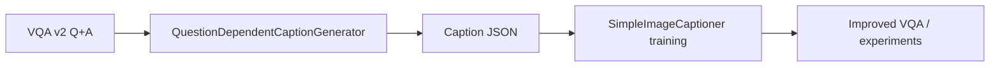
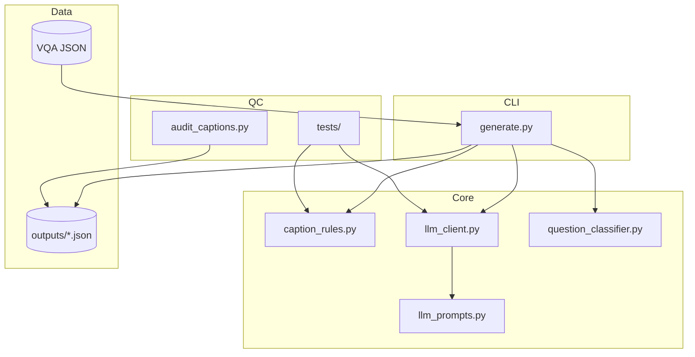
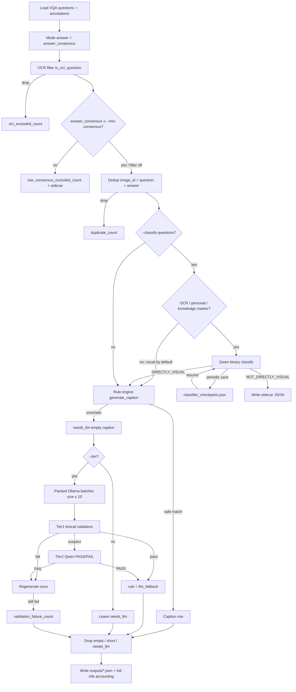
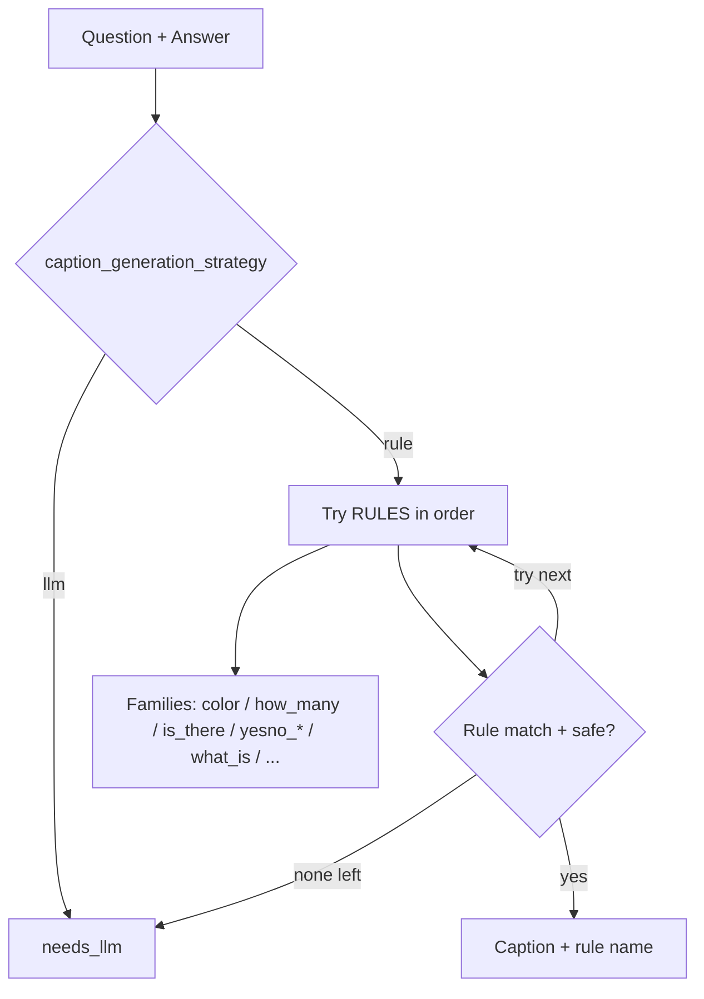
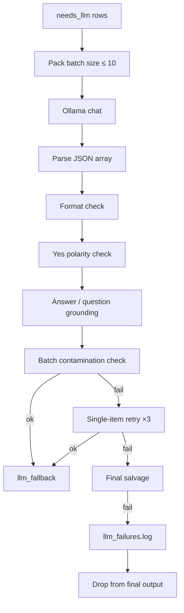
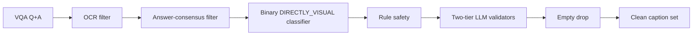

# QuestionDependentCaptionGenerator — Architecture

This document describes the architecture of the **QuestionDependentCaptionGenerator**: a pipeline that turns VQA v2 `(question, answer)` pairs into **question-dependent captions** used as supervision for a visual captioner without OCR.

**Goal:** `(image, question, answer)` → natural declarative sentence, e.g.

| Question | Answer | Caption |
|----------|--------|---------|
| What color is the car? | red | The car is red. |
| Are the animals eating? | yes | The animals are eating. |
| Is there grass? | yes | There is grass. |

**Design principle:** Prefer **high-precision deterministic rules**. Anything uncertain goes to an LLM (Ollama). Rule coverage is not a research goal; clean, reproducible targets are.

---

## 1. Role in the thesis pipeline



The Stage-1 captioner sees pooled visual region features only (no glyph reading). Therefore this generator:

1. **Drops OCR-dependent questions** (signs, websites, letters, logos, …).
2. Produces captions that a non-OCR model can plausibly learn from vision + question context.

---

## 2. Module layout



```
QuestionDependentCaptionGenerator/
├── generate.py              # CLI orchestration + I/O
├── caption_rules.py         # OCR filter + rule engine + routing
├── llm_prompts.py           # Packed batch prompt + few-shots
├── llm_client.py            # Ollama client + validators + retry
├── question_classifier.py   # Binary DIRECTLY_VISUAL / NOT_DIRECTLY_VISUAL
├── audit/audit_captions.py  # Post-hoc QC on output JSON
├── tests/                   # Unit tests for known failure cases
├── architecture/            # This documentation
└── outputs/                 # Generated caption JSON (+ failure logs + sidecar)
```

| Module | Responsibility |
|--------|----------------|
| `generate.py` | Load VQA, run filters/rules/LLM, drop empties, write JSON, resume/checkpoints |
| `caption_rules.py` | `is_ocr_question`, narrow rewrite rules, `generate_caption`, safety gates |
| `llm_prompts.py` | System prompt, few-shots, packed user prompt (`PROMPT_VERSION`) |
| `llm_client.py` | HTTP chat, parse JSON captions, Tier-1 lexical + Tier-2 semantic judge |
| `question_classifier.py` | `DIRECTLY_VISUAL` / `NOT_DIRECTLY_VISUAL`, visual by default; LLM only for OCR / personal / outside-knowledge suspects (~7% of questions; prompt `v5_image_answerable`) |
| `audit/audit_captions.py` | Count residual bugs (`The there`, `made of is`, empty captions, …) |

---

## 3. End-to-end data flow



### Stages (ordered)

1. **Load & mode answer** — Majority of 10 annotators. Store `answer_count` and `answer_consensus`. Low-consensus rows are **kept** unless `--min-consensus` is set.
2. **OCR exclusion** — Heuristic regex + selected `question_type` prefixes.
3. **Optional consensus filter** — `--min-consensus T` (default `0.0` = off) drops pairs whose mode answer got less than `T` annotator agreement: if humans cannot agree, the caption is not a trustworthy training target. Runs **before** dedup so a dropped pair does not occupy the dedup slot. Drops go to `*_low_consensus.json`; count in `info.low_consensus_excluded_count`. On VQA v2 train ~11% of pairs sit below `0.4` and all of them are non-yes/no (a binary answer over 10 annotators cannot fall below `0.5`), so the filter raises the yes/no share of the dataset.
4. **Dedup** — Keep first `(image_id, question, answer)`; store `duplicate_count`.
5. **Optional binary classifier** — **Visual by default**: a question is kept as `DIRECTLY_VISUAL` with no LLM call unless `_NON_VISUAL_SUSPECT_RE` matches an OCR, personal-opinion, or outside-knowledge marker (~7% of VQA v2 train). Suspects go to Qwen (`v5_image_answerable`, which also instructs "when unsure, answer DIRECTLY_VISUAL"). Incremental checkpoint (`*_classifier_checkpoint.json`) every `--classifier-checkpoint-every N` enables resume after interrupt. Dropped `NOT_DIRECTLY_VISUAL` rows go to `*_not_directly_visual.json` (captioner-training filter only).
6. **Rule engine** — First safe match wins; else `needs_llm`. Includes `yesno_is_everyone` and fixed `is_there`/`any`.
7. **Optional LLM fallback** — Packed batches; Tier-1 then Tier-2; **1** regenerate; leftovers become validation failures then dropped.
8. **Hard drop** — Empty / short / `needs_llm` rows never enter the written set.

---

## 4. Rule engine design

**Precision over coverage.** No catch-all template rule. Uncertain parses → `needs_llm`.

### Rule decision flow



### Rule families (order matters)

| Family | Examples | Notes |
|--------|----------|-------|
| Attribute | `what_color`, `what_kind_type`, `what_is_doing` | Tight patterns only |
| Existential | `is_there`, `are_there` | Includes bare nouns (`Is there grass?`) |
| Yes/No specialized | `anyone`, `any`, `all`, `both`, `this_a`, possessive, coordinated, modal | Narrow shapes |
| Yes/No general | `yesno_is_are_predicate` | Locative `Is X with/in/on Y?` is subject+PP; PP leftover must be adjectival/participle; otherwise LLM |
| Wh- | `what_is`, `who` | `made of` / `used for` before default |
| Always LLM | Does/Do/Did, complex Is/Are, free-form which/where/… | Via `caption_generation_strategy` |

### Safety net

`can_generate_safe_rule_caption` rejects broken templates such as `The there …`, `The the …`, `… made of is …`, `the answer is …`, `with his is not …`.

### Routing helpers

| Helper | Effect |
|--------|--------|
| `should_use_llm_for_does_do` | Always LLM |
| `is_complex_is_are_question` | Long / multi-verb / `enough to` / … → LLM |
| `should_use_llm_for_who` | Non-`Who is/are` or messy answers → LLM |
| `caption_generation_strategy` | Top-level `"rule"` vs `"llm"` |

---

## 5. LLM fallback architecture



### Prompts (`llm_prompts.py`)

- Versioned (`PROMPT_VERSION`) for reproducibility.
- One declarative sentence, faithful to the answer, no question echo, no “the answer is”.
- Few-shots + numbered batch → JSON array of captions.

### Validators (`llm_client.py`)

| Check | Rejects |
|-------|---------|
| Format | Empty, &lt;2 words, `?`, brackets/quotes, multi-sentence, “the answer” |
| Yes polarity | `answer=yes` but clear negation (unless question embeds negation) |
| No polarity | `answer=no` but the caption asserts it positively, with no negation at all (`Are the cows in the shade?` + no → `The cows are free range.`) |
| Relation | Fewer than **50%** (`RELATION_MIN_RATIO`) of the question's *required* stems survive in the caption. Required = content stems minus the wh-category noun phrase — the answer *replaces* the category word, so these keep: `What **animal** is this?` → `This is a dog.`; `What **season** is it?` → `It is summer outside.`; `What **sport** is shown here?` → `A skateboarding competition can be seen.`; `What **mode of transportation** is pictured?` → `A car is pictured.` — and minus either/or alternatives (`right **or** left` can only yield one). A verb straight after the wh-word means nothing is exempt, so `What is on the table?` → `The cat is on the chair.` is still rejected. Depiction verbs (`shown`/`pictured`/`seen`) are stopwords so synonym choice does not fail a correct caption |
| Grounding | Missing answer; proper nouns/numbers/colors must be **verbatim** |
| Unsupported facts | Caption invents content absent from Q+A |
| Spurious negation | Non-yes/no answer but caption invents `no`/`not`/… |
| Contamination | Near-duplicate of another batch caption or better match to another Q+A |
| Semantic judge | Suspicious items → Qwen PASS/FAIL; FAIL → 1 regenerate then drop |

**Default batch size is 10.** `single_retries` default is **1**.

---

## 6. Filtering layers (quality gates)



| Gate | When | Outcome |
|------|------|---------|
| OCR regex / `question_type` | Always | Remove text-reading questions |
| Answer consensus | `--min-consensus T` (off at `0.0`) | Drop pairs humans disagreed on; sidecar for dropped pairs |
| Binary classifier | `--classify-questions` | Visual by default, LLM only for suspects; keep DIRECTLY_VISUAL; sidecar for NOT_DIRECTLY_VISUAL |
| Rule safety | Always | Bad templates → LLM or skip |
| Two-tier LLM validators | `--llm` | Reject / regenerate once / drop |
| Empty drop | Always at write | No empty/`needs_llm` in final annotations |

---

## 7. Output schema

```json
{
  "info": {
    "description": "...",
    "num_samples": 1205,
    "input_count": 4000,
    "directly_visual_count": 3500,
    "not_directly_visual_count": 200,
    "ocr_excluded_count": 75,
    "min_consensus": 0.4,
    "low_consensus_excluded_count": 430,
    "duplicate_count": 20,
    "dropped_empty_count": 100,
    "validation_retry_count": 40,
    "validation_failure_count": 15,
    "rule_counts": { "what_color": 181, "llm_fallback": 900 },
    "llm": {
      "model": "qwen2.5:3b-instruct-q4_K_M",
      "batch_size": 10,
      "prompt_version": "v7_verbatim_answers_no_extra_facts",
      "validation": {
        "single_retries": 1,
        "tier": "lexical+semantic_judge",
        "validator_version": "v2_flat_relation_0.5_wh_category_or_aware",
        "relation_min_ratio": 0.5
      },
      "failure_log": "..."
    },
    "question_classifier": {
      "model": "...",
      "prompt_version": "v5_image_answerable",
      "label_counts": { "DIRECTLY_VISUAL": 3500, "NOT_DIRECTLY_VISUAL": 200, "FAST_PATH_VISUAL": 3430 }
    }
  },
  "annotations": [
    {
      "question_id": 9001,
      "image_id": 9,
      "question": "What color are the dishes?",
      "answer": "pink and yellow",
      "answer_count": 3,
      "answer_consensus": 0.3,
      "caption": "The dishes are pink and yellow.",
      "rule": "what_color"
    }
  ]
}
```

Sidecars: `{stem}_not_directly_visual.json` (classifier drops) and `{stem}_low_consensus.json` (`--min-consensus` drops) keep dropped questions for later analysis.

`rule` is a rule name, `llm_fallback`, or (transiently before drop) `needs_llm`.

---

## 8. Operational concerns

| Topic | Behavior |
|-------|----------|
| Resume | Same command continues: classifier checkpoint + LLM `llm_fallback` merge; full skip when output JSON matches `post_filter_count` |
| Classifier checkpoint | `{stem}_classifier_checkpoint.json`; saved every `--classifier-checkpoint-every N`; Ctrl+C safe |
| Checkpoint | Atomic JSON write every N batches; Ctrl+C saves then exits |
| Failure log | `*.json.llm_failures.log` with reason codes |
| Reproducibility | Store model, host, `prompt_version`, batch size, classifier metadata |
| QC audit | `python audit/audit_captions.py outputs/....json` |
| Eval hygiene | DIRECTLY_VISUAL filter applies only to captioner supervision, not raw VQA2 eval |

### Recommended pilot before full train (~443k)

```bash
python generate.py --split train --llm --max-items 25000 --batch-size 10 \
  --classify-questions --model qwen2.5:3b-instruct-q4_K_M \
  --checkpoint-every 50 --output outputs/pilot_25k.json
python audit/audit_captions.py outputs/pilot_25k.json
```

Freeze the generator only after manual spot-checks of rule vs LLM samples.

---

## 9. Design rationale (summary)

1. **Rules for certainty, LLM for ambiguity** — avoids systematic grammatical errors from over-eager parsers.
2. **Filters before supervision** — OCR and non-directly-visual questions would poison a non-OCR captioner.
3. **Two-tier validators after LLM** — lexical relation/verbatim checks plus semantic PASS/FAIL.
4. **Never ship empty targets** — leftover `needs_llm` rows are dropped, not silently trained on.
5. **Metadata for science** — agreement (`answer_consensus`), full exclusion accounting, and generation settings stay with the dataset.
