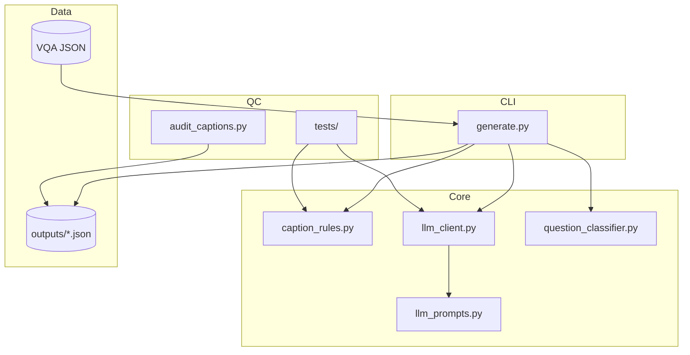
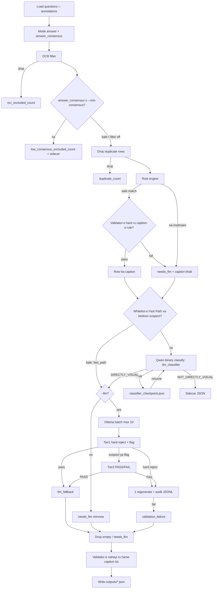
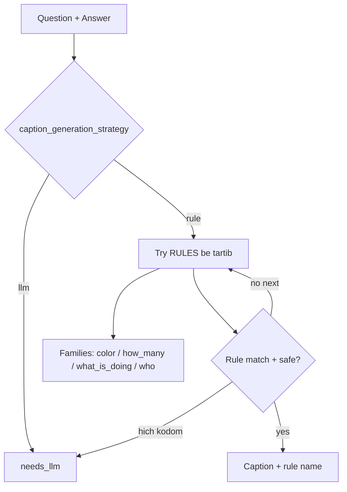
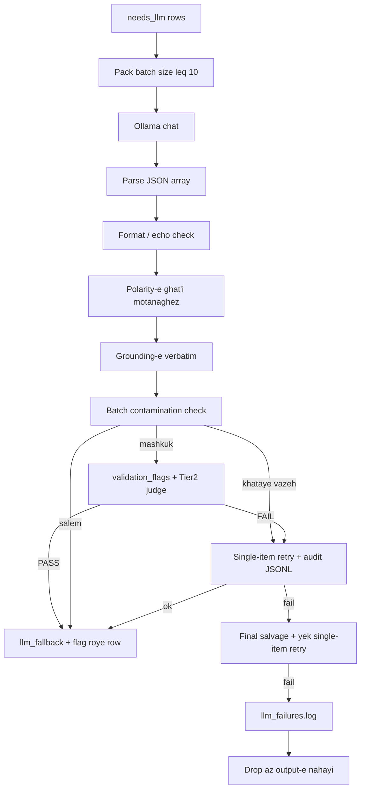

# QuestionDependentCaptionGenerator — Memari / Architecture

In sanad memari-e module-e **QuestionDependentCaptionGenerator** ro tozih mide (Finglish + English).  
This document explains the architecture of **QuestionDependentCaptionGenerator**.

**Hadaf / Goal:** Az joft-e `(soal, javab)` toye VQA v2 yek **caption-e soal-mehvar** besazim ke ba'dan target-e train-e Captioner bashe.

| Soal / Question | Javab / Answer | Caption |
|-----------------|----------------|---------|
| What color is the car? | red | The car is red. |
| Are the animals eating? | yes | The animals are eating. |
| Is there grass? | yes | There is grass. |

**Asl-e tarahi / Design principle:**  
`precision` mohem-tar az `coverage`-e Rule hast. Rule faghat vaghti sakhtar kamelan moshakhas-e ejra mishe; baghiye mire be LLM (Ollama). Hadaf-e pazhuhesh Rule-based boodan nist; hadaf **supervision-e ba-keyfiat va ghabel-e baz-tolid** hast.

---

## 1. Naghsh dar pipeline-e payan-name / Role in the thesis


Captioner-e Stage 1 faghat visual feature mibine va **OCR nadare**. Pas in generator:

1. Soal-haye text-reading (**OCR-dependent**) ro hazf mikone.
2. Soal-haye **NOT_DIRECTLY_VISUAL** ro ba classifier-e binary (hamishe on) drop mikone (OCR-e baghimande, nazar shakhsi, knowledge-e biruni).
3. Caption-hayi misaze ke az rooye image + question ghabile yadgiri bashan.

---

## 2. Sakhtar-e file-ha / Module layout



```
QuestionDependentCaptionGenerator/
├── generate.py              # CLI + orchestration-e kol-e pipeline
├── caption_rules.py         # filter-e OCR + motor-e Rule
├── llm_prompts.py           # packed prompt + few-shot
├── llm_client.py            # Ollama client + validator + retry
├── question_classifier.py   # filter-e binary DIRECTLY_VISUAL / NOT_DIRECTLY_VISUAL
├── audit_captions.py        # audit-e keyfiat rooye JSON
├── tests/                   # unit test rooye bug-haye shenakhte-shode
├── architecture/            # hamin docs
└── outputs/                 # caption JSON (+ failure log)
```

| File | Kar / Responsibility |
|------|----------------------|
| `generate.py` | Load-e VQA, filter-ha, Rule, LLM, drop-e empty, save-e JSON |
| `caption_rules.py` | `is_ocr_question`, ghavanin-e rewrite, `generate_caption` |
| `llm_prompts.py` | System prompt-e version-dar (`PROMPT_VERSION`) |
| `llm_client.py` | Chat API, parse, Tier-1 lexical + Tier-2 semantic judge |
| `question_classifier.py` | DIRECTLY_VISUAL / NOT_DIRECTLY_VISUAL — Fast Path ye **whitelist**-e mohtat (rang / tedad / vojud / makani / animal|sport|room|food|… / do-you-see / doing|holding|wearing); baghie hame be LLM miran (prompt `v8_visual_inference_default`) va har row `visual_filter_source` migire |
| `audit/audit_captions.py` | Shomaresh-e bug-haye baghimande + `visual_filter_source` / `validation_flags` / check-e accounting |

---

## 3. Jaryan-e dade entaha-be-entaha / End-to-end data flow



### Marhale-ha be tartib / Stages

1. **Mode answer** — Az 10 annotator; `answer_consensus` negah dashte mishe (low-consensus default hazf nemishe).
2. **Hazf-e OCR** — Ba regex + chand `question_type`.
3. **Ekhtiari: filter-e consensus** — `--min-consensus T` (default `0.0` = khamush) pair-hayi ke mode answer-eshun kamtar az `T` tavafogh-e annotator dare drop mikone: vaghti adam-ha tavafogh nadaran, oon caption target-e ghabel-e etemad nist. **Ghabl az dedup** ejra mishe ta pair-e drop-shode jaye dedup ro nagire. Drop-ha → `*_low_consensus.json` + `info.low_consensus_excluded_count`. Ru VQA v2 train ~11% zir-e `0.4` hastan va hame non-yes/no (javab-e binary ba 10 annotator nemitune zir-e `0.5` beshe), pas sahm-e yes/no dar dataset bala miravad.
4. **Dedup** — Faghat avalin `(image_id, question, answer)`; `duplicate_count`.
5. **Motor-e Rule** — Family-haye baghimande: `what_color`, `how_many`, `what_is_doing`, `who`. Har caption-e rule ba hamun validator-e hard-e LLM check mishe: fail → `needs_llm` (`info.rule_validation_reject_count`), na template-e kharab.
6. **Classifier-e binary (hamishe on)** — Fast Path ye **whitelist** ast, na default: soal faghat vaghti bedoon LLM label mikhore ke `_FAST_PATH_VISUAL_RE` match kone (rang ba plural; `how many` / `number of`; `is/are there`; `do/can you see`; `is the sky`; `what animal(s)|shape|sport|game|activity|room|scene|place|food(s)|fruit(s)|dish`; `what is under/over/…`; spatial-e end-anchored; `what … doing|holding|wearing`-e end-anchored) **va** hich marker-e `_NON_VISUAL_SUSPECT_RE` nadashte bashe. Fast-path **nist** (UNKNOWN → LLM): bare `what is/are/do/does`, `what kind/type`, `is he/she`, `where is`, `could this`, `does this look`, `who is`, …. Baghie be Qwen miran (`v8_visual_inference_default`). `--no-fast-path` whitelist ro kollan khamoosh mikone. Har row `visual_filter_source` (`fast_path` / `llm_classifier`) migire — row-haye `*_not_directly_visual.json` ham. Checkpoint (`*_classifier_checkpoint.json`) har `--classifier-checkpoint-every N` save mishe va ba `fast_path_enabled` key mikhore, pas run-e Fast Path ba run-e `--no-fast-path` checkpoint share nemikonan. Ollama baraye in marhale lazem ast hata bedoon `--llm`.
7. **Ekhtiari: LLM** — Tier-1 (hard reject + flag) + Tier-2; 1 regenerate; salvage ham ye single-item retry dare, pas parse failure-e batch bedoon test-e tanha drop nemishe. Har retry → `*_validation_audit.jsonl`.
8. **Hazf-e sakht** — Caption-e khali / `needs_llm` toye file-e nahayi neveshte nemishe.
9. **Pass-e nahayi-e validator** — Check-haye hard ye bar dige ru **hame** caption ha (rule + LLM); moshkel-haye mashkuk → `validation_flags` va row mimoone (`info.validation_flagged_count`).

---

## 4. Memari-e motor-e Rule / Rule engine

**Bedoon catch-all.** Age parse motmaen nabashe → `None` → LLM.

### Flowchart-e tasmim-e Rule / Rule decision flow



### Family-haye ghanun / Rule families

Ghavanin-e khastar-tar aval ejra mishan (rang, tedad, doing, who).

| Family | Mesal | Note |
|--------|-------|------|
| Attribute | `what_color`, `what_is_doing` | Faghat pattern-e ghat'i |
| Count | `how_many` | Faghat 2 shape (`are there` / `are in/on`) |
| Wh- | `who` | Javab-e na-motmaen → LLM |
| Hamishe LLM | Does/Do/Did, hame-ye Is/Are/Was/Were, `What kind/type of …`, `Can/Could/Will/Would/Has/Have/Had`, hame-ye `What is …?` | Az `caption_generation_strategy` + rule-haye hazf-shode |

### Rule-haye hazf-shode (Comments8)

| Rule | Moshkel | Alan |
|------|---------|------|
| `yesno_modal_have` | Auxiliary ro jabeja mikard: "This photo be could …", "The plane fly will …" | Hazf shod — hamishe `needs_llm` |
| `what_is` | Sub-type haye ziad-e `What is …?` bedoon parser mishkanand (`What is it called?`, `What is it for?`, `What is the weather like?`) | Hazf shod — hamishe `needs_llm` |

`what_is_doing` rule-e jodast va avaz nashode.

### Rule-haye hazf-shode (Comments9)

| Rule | Moshkel | Alan |
|------|---------|------|
| `what_kind_type` | Compound NP (`birthday celebration` vs identity head `donuts`) bedoon parser motmaen nist | Hazf shod — hamishe `needs_llm` |
| Family-e Is/Are (`is_there`, `are_there`, `yesno_is_*` / `yesno_are_*` / `yesno_is_are_*`) | Split-e subject/predicate (locative, quantifier, leftover-e PP) fragile bud | Hazf shod — hamishe `needs_llm` |

### Tor-e imeni / Safety net

`can_generate_safe_rule_caption` template-haye kharab ro rad mikone:

- `The there …`, `The the …`
- `… made of is …`
- `the answer is …`
- `with his is not …` (PP-object-e chop-shode)

### Routing

| Function | Asar |
|----------|------|
| `should_use_llm_for_does_do` | Hamishe LLM |
| `should_use_llm_for_what_kind_type` | Hamishe LLM baraye `What kind/type of …` |
| `should_use_llm_for_is_are` | Hamishe LLM baraye Is/Are/Was/Were |
| `should_use_llm_for_who` | Who-e gheyr-sade → LLM |
| `caption_generation_strategy` | `"rule"` vs `"llm"` |

---

## 5. Memari-e LLM fallback



### Prompt (`llm_prompts.py`)

- Version-dar baraye reproducibility.
- Yek jomle-ye ezhari, vafadar be javab, bedoon tekrar-e soal va bedoon "the answer is".
- Chand few-shot + batch-e shomare-dar → array-e JSON az caption-ha.

### Validator-ha (`llm_client.py`)

Ghaide (Comments8 band-e 6): regex faghat chizi ro rad mikone ke **taghriban ghat'i** ghalat ast; har chi faghat mashkuk ast flag mikhore. Validator ru **hame** caption ha (rule + LLM) run mishe.

**Reject-haye hard**

| Check | Chi rad mishe |
|-------|---------------|
| Format | Khali, kootah, soal, chand-jomle, bracket |
| Echo | Caption faghat soal ro tekrar karde |
| Yes polarity | Javab yes vali negation-e jomle-i ya shoru' ba "No" |
| No polarity | Javab `no` vali caption sarih "Yes" migeh |
| Spurious negation | Javab gheyr-e yes/no vali negation-e jomle-i-e sakhtagi. `no` toye noun phrase (`a no parking sign`) hesab **nemishe** |
| Grounding | Proper noun / adad / rang / javab-e kutah bayad **verbatim** bashe (Loon ≠ Loom) |
| Contamination | Jabeja shodan-e caption beyn-e item-haye yek batch |
| Semantic judge | Tier-2 Qwen FAIL → 1 regenerate ba'd drop |

**Flag ha (`validation_flags`, row mimoone)**

| Flag | Ma'ni |
|------|-------|
| `relation_low` | Kamtar az **50%** (`RELATION_MIN_RATIO`) az stem-haye *required*-e soal toye caption ast. required = content stem-ha menha-ye wh-category NP — javab *jaye* esm-e daste ro migire (`What **animal** is this?` → `This is a dog.`; `What **mode of transportation** is pictured?` → `A car is pictured.`) va menha-ye either/or alternatives. Fe'l-haye depiction (`shown`/`pictured`/`seen`) stopword hastan |
| `unsupported_facts_suspect` | Content word-e ezafe ke toye Q+A nist |
| `no_answer_without_negation` | Javab `no` vali caption negation nadare — ghalaban paraphrase-e dorost (`Was this taken during the day?` + no → `It is taken at night.`) |
| `answer_partial_match` | Kamtar az 50% token-haye javab-e tulani-tar |

Do fix in daghat ro momken karde: `_stem` do bar suffix strip mikone (pas `buildings` va `building` yek stem daran va relation mismatch-e ghalat pish nemiyad), va negation-e determiner-i toye noun phrase nadide gerefte mishe (`The sign says no parking.` jomle-ye mosbat ast).

**Batch size-e pishfarz 10.** `single_retries` pishfarz **1** — salvage ham hamintor.

### Retry audit log

`{stem}_validation_audit.jsonl` baraye har item-e retry-shode yek record dare: `retry_kind` (`validator` / `generation`), `first_caption`, `failure_reason`, `retry_caption`, `final_result` (`accepted`/`dropped`), `stage` (`main`/`salvage`). Ghablan retry-e movafagh hich asari nemigozasht.

---

## 6. Laye-haye filter-e keyfiat / Quality gates


| Gate | Zaman | Natije |
|------|-------|--------|
| OCR | Hamishe | Hazf-e soal-haye text-reading (hala `number on …`, `shirt/train number`, `street name`, `written/printed on …`, `letters/initials on …` ham) |
| Rule safety + validator | Hamishe | Template-e kharab → LLM (`rule_validation_reject_count`) |
| Binary classifier | Hamishe | Faghat whitelist-e Fast Path bedoon LLM; baghie be LLM dar batch-haye packed (`--classifier-batch-size`, default 10, JSON labels); sidecar baraye NOT_DIRECTLY_VISUAL; `visual_filter_source` roye har row |
| Two-tier validators | Ba `--llm` | Hard reject → 1 regenerate → drop; mashkuk → flag + Tier-2 |
| Empty drop | Hengam-e neveshtan | Hich target-e khali vared-e train nemishe |
| Validator-e nahayi | Hengam-e neveshtan | Check-e hard ru hame caption ha; mashkuk → `validation_flags` |

---

## 7. Ghalab-e khorooji / Output schema

```json
{
  "info": {
    "num_samples": 1205,
    "input_count": 4000,
    "directly_visual_count": 3500,
    "not_directly_visual_count": 200,
    "ocr_excluded_count": 75,
    "min_consensus": 0.4,
    "low_consensus_excluded_count": 430,
    "duplicate_count": 20,
    "dropped_empty_count": 100,
    "validation_retry_count": 40,
    "validation_failure_count": 15,
    "validation_flagged_count": 60,
    "rule_validation_reject_count": 12,
    "rule_counts": { "...": "..." },
    "llm": {
      "model": "...",
      "batch_size": 10,
      "prompt_version": "v8_kind_type_and_is_are_llm",
      "validation": {
        "single_retries": 1,
        "salvage_single_retries": 1,
        "tier": "lexical+semantic_judge",
        "validator_version": "v3_high_precision_reject_plus_flags",
        "relation_min_ratio": 0.5
      },
      "retry_audit_log": "..."
    },
    "question_classifier": {
      "prompt_version": "v8_visual_inference_default",
      "fast_path_enabled": true,
      "batch_size": 10,
      "label_counts": { "DIRECTLY_VISUAL": 3500, "NOT_DIRECTLY_VISUAL": 200, "FAST_PATH_VISUAL": 1390 }
    }
  },
  "annotations": [
    {
      "question_id": 9001,
      "question": "What color are the dishes?",
      "answer": "pink and yellow",
      "caption": "The dishes are pink and yellow.",
      "rule": "what_color",
      "visual_filter_source": "fast_path"
    }
  ]
}
```

Sidecar-ha: `{stem}_not_directly_visual.json` (ba `visual_filter_source`), `{stem}_low_consensus.json`, va `{stem}_validation_audit.jsonl`. Filter-ha faghat baraye train-e Captioner; VQA2 eval dast nakhord.

`answer_consensus` = tavaghof-e annotator-ha; sample-haye consensus-e payin default **hazf nemishan** (faghat ba `--min-consensus T`).

---

## 8. Amaliat va baz-tolidpaziri / Operations

| Mozu | Raftar |
|------|--------|
| Resume | Hamoon dastur edame mide: classifier checkpoint + LLM merge; full skip vaghti output ba `post_filter_count` match kone |
| Classifier checkpoint | `{stem}_classifier_checkpoint.json`; har `--classifier-checkpoint-every N`; Ctrl+C safe; ba `prompt_version` **va** `fast_path_enabled` key mikhore |
| Checkpoint | Save-e atomic har N batch; Ctrl+C ham save mikone |
| Failure log | `*.json.llm_failures.log` ba dalil-e khata |
| Retry audit log | `{stem}_validation_audit.jsonl` — yek record baraye har item-e retry-shode |
| Audit | `python audit/audit_captions.py outputs/....json` |

### Pilot-e pishnahadi ghabl az kol-e train (~443 hezar)

```bash
python generate.py --split train --llm --max-items 25000 --batch-size 10 \
  --model qwen2.5:3b-instruct-q4_K_M \
  --checkpoint-every 50 --output outputs/pilot_25k.json
python audit/audit_captions.py outputs/pilot_25k.json
```

Bad az barresi-ye dasti-ye sample-haye Rule va LLM, version-e generator ro freeze konid.

---

## 9. Jam-bandi-ye dalayel-e tarahi / Design rationale

1. **Rule baraye ghat'iyat, LLM baraye ebham** — ta khata-ye dasturi-ye systematic kam beshe.
2. **Filter ghabl az supervision** — OCR va soal-e zehni signal-e train ro alude mikonan.
3. **Validator ba'd az LLM** — faghat mahdudiat-e prompt kafi nist (bargardandan-e polarity, gati-e batch).
4. **Hargez target-e khali naferest** — `needs_llm`-e baghimande drop mishe.
5. **Metadata-ye elmi** — consensus, shomaresh-e hazf-ha, model va version-e prompt baraye reproducibility-e payan-name.
