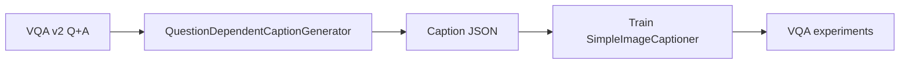
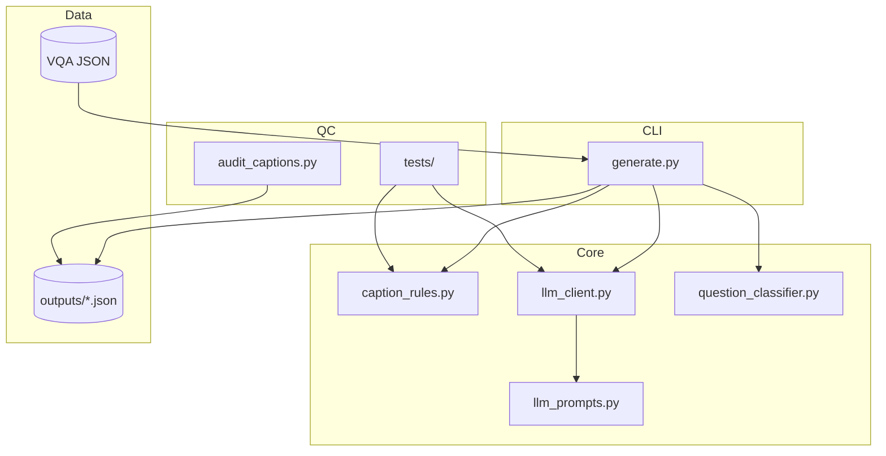
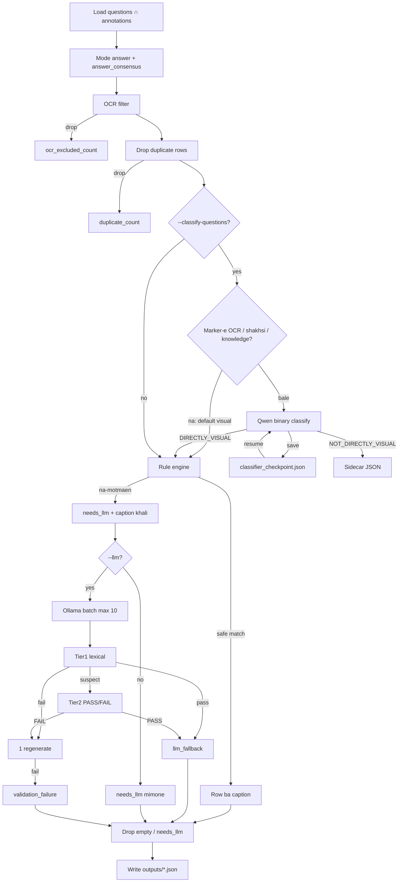
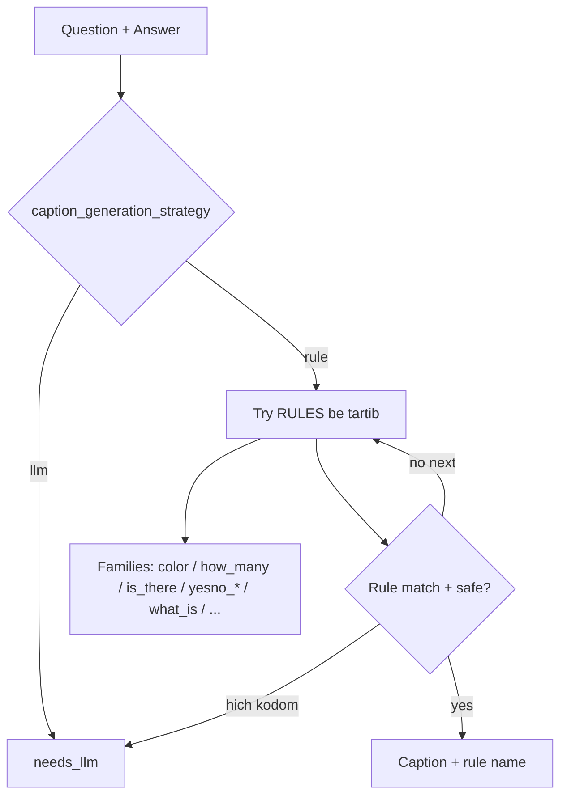
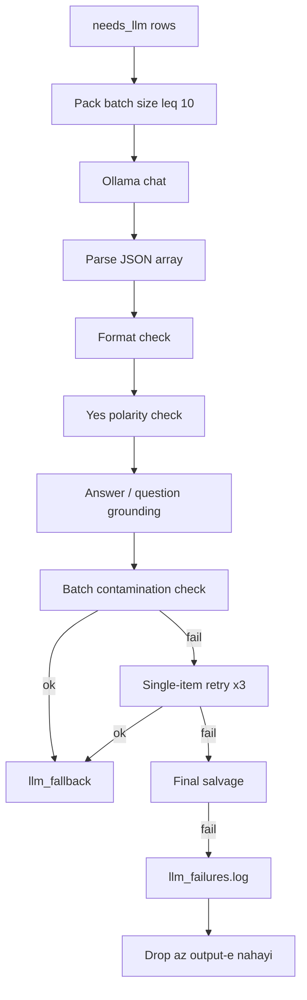

# QuestionDependentCaptionGenerator — Memari / Architecture

In sanad memari-e module-e **QuestionDependentCaptionGenerator** ro tozih mide (Finglish + English).  
This document explains the architecture of **QuestionDependentCaptionGenerator**.

**Hadaf / Goal:** Az joft-e `(soal, javab)` toye VQA v2 yek **caption-e soal-mehvar** besazim ke ba'dan target-e train-e Captioner bashe.

| Soal / Question | Javab / Answer | Caption |
|-----------------|----------------|---------|
| What color is the car? | red | The car is red. |
| Are the animals eating? | yes | The animals are eating. |
| Is there grass? | yes | There is grass. |

**Asl-e tarahi / Design principle:**  
`precision` mohem-tar az `coverage`-e Rule hast. Rule faghat vaghti sakhtar kamelan moshakhas-e ejra mishe; baghiye mire be LLM (Ollama). Hadaf-e pazhuhesh Rule-based boodan nist; hadaf **supervision-e ba-keyfiat va ghabel-e baz-tolid** hast.

---

## 1. Naghsh dar pipeline-e payan-name / Role in the thesis



Captioner-e Stage 1 faghat visual feature mibine va **OCR nadare**. Pas in generator:

1. Soal-haye text-reading (**OCR-dependent**) ro hazf mikone.
2. Caption-hayi misaze ke az rooye image + question ghabile yadgiri bashan.

---

## 2. Sakhtar-e file-ha / Module layout



```
QuestionDependentCaptionGenerator/
├── generate.py              # CLI + orchestration-e kol-e pipeline
├── caption_rules.py         # filter-e OCR + motor-e Rule
├── llm_prompts.py           # packed prompt + few-shot
├── llm_client.py            # Ollama client + validator + retry
├── question_classifier.py   # filter-e binary DIRECTLY_VISUAL / NOT_DIRECTLY_VISUAL
├── audit_captions.py        # audit-e keyfiat rooye JSON
├── tests/                   # unit test rooye bug-haye shenakhte-shode
├── architecture/            # hamin docs
└── outputs/                 # caption JSON (+ failure log)
```

| File | Kar / Responsibility |
|------|----------------------|
| `generate.py` | Load-e VQA, filter-ha, Rule, LLM, drop-e empty, save-e JSON |
| `caption_rules.py` | `is_ocr_question`, ghavanin-e rewrite, `generate_caption` |
| `llm_prompts.py` | System prompt-e version-dar (`PROMPT_VERSION`) |
| `llm_client.py` | Chat API, parse, Tier-1 lexical + Tier-2 semantic judge |
| `question_classifier.py` | DIRECTLY_VISUAL / NOT_DIRECTLY_VISUAL — default visual; faghat suspect-haye OCR / nazar-e shakhsi / knowledge-e biruni be LLM miran (~7% soal-ha; prompt `v5_image_answerable`) |
| `audit/audit_captions.py` | Shomaresh-e bug-haye baghimande bad az generate |

---

## 3. Jaryan-e dade entaha-be-entaha / End-to-end data flow



### Marhale-ha be tartib / Stages

1. **Mode answer** — Az 10 annotator; `answer_consensus` negah dashte mishe (low-consensus hazf nemishe).
2. **Hazf-e OCR** — Ba regex + chand `question_type`.
3. **Dedup** — Faghat avalin `(image_id, question, answer)`; `duplicate_count`.
4. **Ekhtiari: classifier-e binary** — **Default visual**: har soal `DIRECTLY_VISUAL` mimune bedoon LLM call, magar `_NON_VISUAL_SUSPECT_RE` match kone (marker-e OCR / nazar-e shakhsi / knowledge-e biruni — ~7% VQA v2 train). Suspect-ha be Qwen miran (`v5_image_answerable`: "vaghti motmaen nisti, DIRECTLY_VISUAL bede"). Checkpoint-e incremental (`*_classifier_checkpoint.json`) har `--classifier-checkpoint-every N` — resume ba'd az Ctrl+C. Drop-ha → sidecar.
5. **Motor-e Rule** — Shamel `yesno_is_everyone` va `is_there` ba `any`-e dorost.
6. **Ekhtiari: LLM** — Tier-1 + Tier-2; 1 regenerate; ba'd drop.
7. **Hazf-e sakht** — Caption-e khali / `needs_llm` toye file-e nahayi neveshte nemishe.

---

## 4. Memari-e motor-e Rule / Rule engine

**Bedoon catch-all.** Age parse motmaen nabashe → `None` → LLM.

### Flowchart-e tasmim-e Rule / Rule decision flow



### Family-haye ghanun / Rule families

Ghavanin-e khastar-tar aval ejra mishan (rang, tedad, type, who, vojud-i, yes/no-e takhasosi, ba'd predicate va what-is).

| Family | Mesal | Note |
|--------|-------|------|
| Attribute | `what_color`, `what_kind_type` | Faghat pattern-e ghat'i |
| Existential | `is_there`, `are_there` | `a`/`an`/`any` as whole words (`Is there any window?`) |
| Yes/No takhasosi | anyone / everyone / any / all / both / this_a / … | Shape-e narrow |
| Yes/No omoomi | `yesno_is_are_predicate` | everyone/anyone → rule-e joda ya LLM |
| Wh- | `what_is`, `who` | Aval `made of` / `used for` |
| Hamishe LLM | Does/Do/Did, Is/Are-e pichide | Az `caption_generation_strategy` |

### Tor-e imeni / Safety net

`can_generate_safe_rule_caption` template-haye kharab ro rad mikone:

- `The there …`, `The the …`
- `… made of is …`
- `the answer is …`

### Routing

| Function | Asar |
|----------|------|
| `should_use_llm_for_does_do` | Hamishe LLM |
| `is_complex_is_are_question` | Jomle-haye pichide → LLM |
| `should_use_llm_for_who` | Who-e gheyr-sade → LLM |
| `caption_generation_strategy` | `"rule"` vs `"llm"` |

---

## 5. Memari-e LLM fallback



### Prompt (`llm_prompts.py`)

- Version-dar baraye reproducibility.
- Yek jomle-ye ezhari, vafadar be javab, bedoon tekrar-e soal va bedoon "the answer is".
- Chand few-shot + batch-e shomare-dar → array-e JSON az caption-ha.

### Validator-ha (`llm_client.py`)

| Check | Chi rad mishe |
|-------|---------------|
| Format | Khali, kootah, soal, chand-jomle, bracket |
| Yes polarity | Javab yes vali caption manfi-ye vazeh |
| Relation | Stem-haye asli-e soal toye caption nabashan (shade≠free range) |
| Grounding | Proper noun / adad / rang **verbatim**; digar ≥50% |
| Unsupported facts | Vaghe'iyat-e ezafi ke toye Q+A nist |
| Spurious negation | Javab gheyr-e yes/no vali caption manfi-ye sakhtagi |
| Contamination | Jabeja shodan-e caption beyn-e item-haye yek batch |
| Semantic judge | Mashkuk → Qwen PASS/FAIL; FAIL → 1 regenerate ba'd drop |

**Batch size-e pishfarz 10.** `single_retries` pishfarz **1**.

---

## 6. Laye-haye filter-e keyfiat / Quality gates


| Gate | Zaman | Natije |
|------|-------|--------|
| OCR | Hamishe | Hazf-e soal-haye text-reading |
| Binary classifier | Ba `--classify-questions` | Default visual; LLM faghat baraye suspect-ha; keep DIRECTLY_VISUAL; sidecar baraye NOT_DIRECTLY_VISUAL |
| Rule safety | Hamishe | Template-e kharab → LLM |
| Two-tier validators | Ba `--llm` | Rad / 1 regenerate / drop |
| Empty drop | Hengam-e neveshtan | Hich target-e khali vared-e train nemishe |

---

## 7. Ghalab-e khorooji / Output schema

```json
{
  "info": {
    "num_samples": 1205,
    "input_count": 4000,
    "directly_visual_count": 3500,
    "not_directly_visual_count": 200,
    "ocr_excluded_count": 75,
    "duplicate_count": 20,
    "dropped_empty_count": 100,
    "validation_retry_count": 40,
    "validation_failure_count": 15,
    "rule_counts": { "...": "..." },
    "llm": { "model": "...", "batch_size": 10, "prompt_version": "v7_..." },
    "question_classifier": {
      "prompt_version": "v5_image_answerable",
      "label_counts": { "DIRECTLY_VISUAL": 3500, "NOT_DIRECTLY_VISUAL": 200, "FAST_PATH_VISUAL": 3430 }
    }
  },
  "annotations": [ { "...": "..." } ]
}
```

Sidecar: `{stem}_not_directly_visual.json`. Filter faghat baraye train-e Captioner; VQA2 eval dast nakhord.

`answer_consensus` = tavaghof-e annotator-ha; sample-haye consensus-e payin **hazf nemishan**.

---

## 8. Amaliat va baz-tolidpaziri / Operations

| Mozu | Raftar |
|------|--------|
| Resume | Hamoon dastur edame mide: classifier checkpoint + LLM merge; full skip vaghti output ba `post_filter_count` match kone |
| Classifier checkpoint | `{stem}_classifier_checkpoint.json`; har `--classifier-checkpoint-every N`; Ctrl+C safe |
| Checkpoint | Save-e atomic har N batch; Ctrl+C ham save mikone |
| Failure log | `*.json.llm_failures.log` ba dalil-e khata |
| Audit | `python audit/audit_captions.py outputs/....json` |

### Pilot-e pishnahadi ghabl az kol-e train (~443 hezar)

```bash
python generate.py --split train --llm --max-items 25000 --batch-size 10 \
  --classify-questions --model qwen2.5:3b-instruct-q4_K_M \
  --checkpoint-every 50 --output outputs/pilot_25k.json
python audit/audit_captions.py outputs/pilot_25k.json
```

Bad az barresi-ye dasti-ye sample-haye Rule va LLM, version-e generator ro freeze konid.

---

## 9. Jam-bandi-ye dalayel-e tarahi / Design rationale

1. **Rule baraye ghat'iyat, LLM baraye ebham** — ta khata-ye dasturi-ye systematic kam beshe.
2. **Filter ghabl az supervision** — OCR va soal-e zehni signal-e train ro alude mikonan.
3. **Validator ba'd az LLM** — faghat mahdudiat-e prompt kafi nist (bargardandan-e polarity, gati-e batch).
4. **Hargez target-e khali naferest** — `needs_llm`-e baghimande drop mishe.
5. **Metadata-ye elmi** — consensus, shomaresh-e hazf-ha, model va version-e prompt baraye reproducibility-e payan-name.
