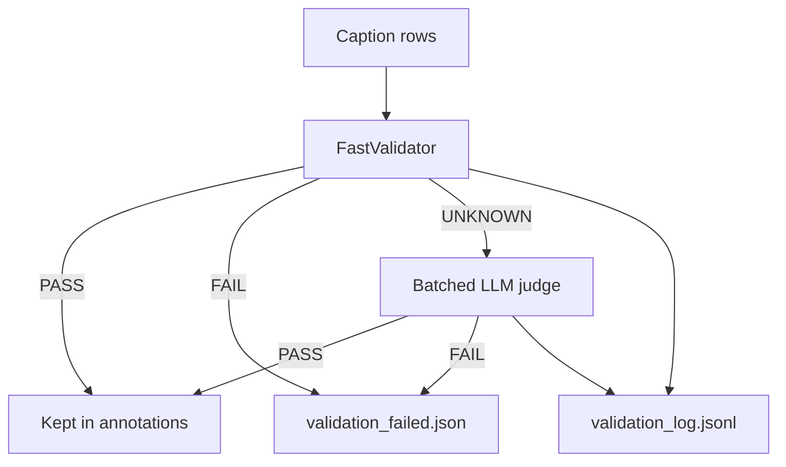

# Caption Validator (`validation/`)

Two-layer validator for question-dependent captions produced by
[`generate.py`](../generate.py). The **fast layer** assigns each caption
`PASS`, `FAIL`, or `UNKNOWN` without calling an LLM. The **LLM layer** judges
only `UNKNOWN` items in batches (`PASS` / `FAIL`).

The fast validator does **not** decide semantic correctness — only whether we
have enough confidence to accept or reject without an LLM.

## Architecture



## Fast validator rules

### 1.1 Empty caption

`caption.strip()` is empty → **FAIL** (`empty_caption`).

### 1.2 Brackets, quotes, question mark

Caption contains `(...)`, `[...]`, `{...}`, `"..."`, `'...'`, or `?` → **FAIL**.

### 1.3 Sentence length

- Fewer than `min_words` (default **3**) → **FAIL** (`too_short`)
- More than `max_words` (default **30**) → **FAIL** (`too_long`)

### 1.4 Asymmetric overlap

Overlap ratio:

`|required_question_stems ∩ caption_stems| / |required_question_stems|`

Uses light stemming and wh-category exclusion (see `overlap.py`).

| Band | Condition | Verdict |
|------|-----------|---------|
| Fail | `ratio < overlap_fail_threshold` (0.30) | **FAIL** |
| Borderline | between fail and pass thresholds | **UNKNOWN** |
| Pass band | `ratio >= overlap_pass_threshold` (0.50) | candidate for **PASS** |

**PASS** (fast, no LLM) only when format + overlap pass band + all hard
grounding checks pass + no soft flags.

Hard rejects also include: `echoes_question`, `polarity_mismatch`,
`spurious_negation`, `answer_mismatch`, `batch_contamination`.

### Verdict semantics

| Verdict | Meaning |
|---------|---------|
| `PASS` | High confidence accept without LLM |
| `FAIL` | High confidence reject without LLM |
| `UNKNOWN` | Escalate to batched LLM judge |

## LLM judge

- Input: items with `fast_verdict == UNKNOWN`
- Prompt: VQA caption PASS/FAIL rules + 10 few-shot examples (5 PASS, 5 FAIL)
  in `llm_validator.py` (`_JUDGE_RULES_AND_FEW_SHOTS`)
- PASS when the caption is grammatical, expresses the answer, and adds no
  facts beyond Q+A (natural paraphrases / antonyms for no-answers are PASS)
- FAIL on grammar errors, missing/wrong answer, hallucinations, meaning
  change, or unnecessary extra details
- Output: JSON array `[{"id": 0, "verdict": "PASS"|"FAIL"}, ...]`
- Fail-closed on parse errors
- Default batch size: 10 (`ValidationConfig.llm_batch_size`)

## Configuration (`ValidationConfig`)

| Field | Default | When to tune |
|-------|---------|--------------|
| `min_words` | 3 | Allow shorter captions |
| `max_words` | 30 | Longer declarative sentences |
| `overlap_fail_threshold` | 0.30 | Stricter unrelated-caption rejection |
| `overlap_pass_threshold` | 0.50 | More fast PASS vs more LLM calls |
| `llm_batch_size` | 10 | Ollama throughput |

`validator_version`: `v5_judge_rules_few_shot`

## Output files

| File | Description |
|------|-------------|
| `{stem}_validation_log.jsonl` | One JSON record per row (all verdicts) |
| `{stem}_validation_failed.json` | Rows with `final_verdict == FAIL` |

Log record fields: `question_id`, `captions_trace[]`, `fast_verdict`,
`fast_reasons`, `llm_verdict`, `final_verdict`.

## CLI (standalone re-validation)

From `QuestionDependentCaptionGenerator/`:

```bash
python -m validation.cli outputs/vqa_v2_question_dependent_captions_train2014.json \
  --llm --batch-size 10 \
  --overlap-fail 0.30 --overlap-pass 0.50
```

## Integration with `generate.py`

1. **Rule stage** (`load_vqa_pairs`): `fast_validate` → `FAIL` routes to `needs_llm`
2. **LLM stage** (`apply_llm_fallbacks`): `validate_generated_batch` after each generation
3. **Final pass** (`final_validation_pass`): full pipeline + `validation_log.jsonl`

## Worked examples

### PASS (fast)

| Q | A | Caption |
|---|---|---------|
| What color are the dishes? | pink and yellow | The dishes are pink and yellow. |

→ `fast_verdict: PASS`

### FAIL (fast — interrogative echo)

| Q | A | Caption |
|---|---|---------|
| How many flags do you see | 1 | one flag do you see |

→ `fast_verdict: FAIL`, reason `echoes_question` (overlap alone would be misleading)

### UNKNOWN → LLM

Borderline overlap or soft flags (e.g. `relation_low`) → batched LLM judge.

## Module layout

| File | Role |
|------|------|
| `config.py` | `ValidationConfig`, `VALIDATOR_VERSION` |
| `tokens.py` | Stemming, content words, required stems |
| `checks.py` | Format, hard rejects, soft flags |
| `overlap.py` | Overlap ratio and bands |
| `fast_validator.py` | `fast_validate()` → PASS/FAIL/UNKNOWN |
| `llm_validator.py` | Batched LLM PASS/FAIL judge |
| `logging.py` | `ValidationTrace`, JSONL writer |
| `pipeline.py` | `validate_rows()` orchestration |
| `batch_integration.py` | Hook for `llm_client.captions_with_retry` |
| `cli.py` | Standalone re-validation CLI |
