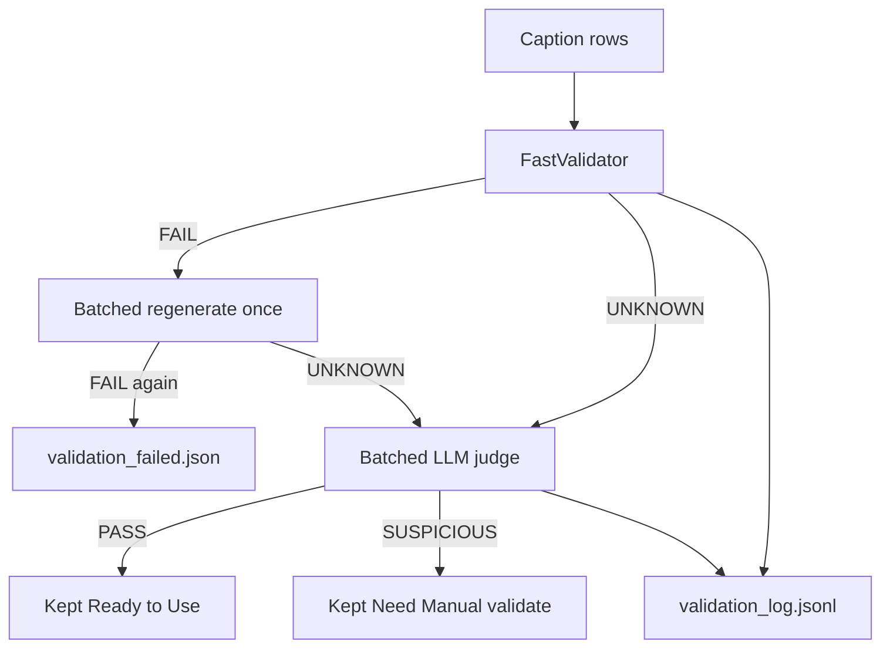

# Caption Validator (`validation/`)

Two-layer validator for question-dependent captions produced by
[`generate.py`](../generate.py). The **fast layer** assigns each caption
`FAIL` or `UNKNOWN` without calling an LLM (it never auto-accepts). The
**LLM layer** judges every `UNKNOWN` item in batches (`PASS` / `SUSPICIOUS`).

The fast validator does **not** decide semantic correctness — only whether we
have enough confidence to hard-reject without an LLM.

## Architecture


```mermaid
flowchart TD
  Rows[Caption rows] --> Fast[FastValidator]
  Fast -->|FAIL| Retry[Batched regenerate once]
  Retry -->|FAIL again| Sidecar[validation_failed.json]
  Retry -->|UNKNOWN| LLM
  Fast -->|UNKNOWN| LLM[Batched LLM judge]
  LLM -->|PASS| Keep[Kept Ready to Use]
  LLM -->|SUSPICIOUS| KeepSus[Kept Need Manual validate]
  Fast --> Log[validation_log.jsonl]
  LLM --> Log
```

## Fast validator rules

### 1.1 Empty caption

`caption.strip()` is empty → **FAIL** (`empty_caption`).

### 1.2 Brackets, quotes, question mark

Caption contains `(...)`, `[...]`, `{...}`, `"..."`, `'...'`, or `?` → **FAIL**.

### 1.3 Sentence length

- Fewer than `min_words` (default **3**) → **FAIL** (`too_short`)
- More than `max_words` (default **30**) → **FAIL** (`too_long`)

### 1.4 Asymmetric overlap (soft)

Overlap ratio:

`|required_question_stems ∩ caption_stems| / |required_question_stems|`

Uses light stemming and wh-category exclusion (see `overlap.py`).

| Band | Condition | Fast verdict |
|------|-----------|--------------|
| Low | `ratio < overlap_fail_threshold` (0.30) | **UNKNOWN** + flag `overlap_too_low` |
| Borderline | between fail and pass thresholds | **UNKNOWN** + flag `overlap_borderline` |
| High | `ratio >= overlap_pass_threshold` (0.50) | **UNKNOWN** (no overlap soft flag) |

Low overlap is **never** a hard FAIL — the LLM judge decides.

Hard rejects only: format issues, `echoes_question`, `polarity_mismatch`,
`quantifier_mismatch`, `batch_contamination`.

(`spurious_negation` and `answer_mismatch` are **not** hard rejects — they
escalate as UNKNOWN for the LLM judge.)

Number grounding: digit↔word for **0–99** (e.g. `40` ↔ `forty`); answer `1`
also matches `one` / `a` / `an`.

Quantifiers: clear contradiction on `all` / `both` / `any` → **FAIL**.
Missing quantity cue on `all` / `both` / … → soft flag + **UNKNOWN**.
Bare existential `any` (“Are there any flowers…?”) does **not** require a
quantity word in the caption.

### Verdict semantics

| Verdict | Meaning |
|---------|---------|
| `FAIL` | High confidence reject without LLM → batched regenerate once, then drop |
| `UNKNOWN` | Escalate to batched LLM judge (every non-FAIL caption) |

There is **no** fast `PASS`.

## LLM judge

- Input: items with `fast_verdict == UNKNOWN`
- Prompt: aligned with caption-generation rules + few-shots in
  `llm_validator.py` (`_JUDGE_RULES_AND_FEW_SHOTS`)
- PASS when the caption is grammatical, expresses the answer, and adds no
  facts beyond Q+A (natural paraphrases / articles / digit↔word / omitted
  redundant question nouns / action paraphrases such as
  \"What are the animals doing? / eating\" → \"The animals are eating.\" /
  quantifier phrasing such as \"Not both …\" are PASS)
- SUSPICIOUS on grammar errors, missing/wrong answer, hallucinations, meaning
  change, or unnecessary extra details — **caption is kept** and logged
- Output: JSON array `[{"id": 0, "verdict": "PASS"|"SUSPICIOUS"}, ...]`
- Fail-closed toward SUSPICIOUS on parse errors (still kept)
- Default batch size: 10 (`ValidationConfig.llm_batch_size`)

## Configuration (`ValidationConfig`)

| Field | Default | When to tune |
|-------|---------|--------------|
| `min_words` | 3 | Allow shorter captions |
| `max_words` | 30 | Longer declarative sentences |
| `overlap_fail_threshold` | 0.30 | Soft-flag low-overlap captions |
| `overlap_pass_threshold` | 0.50 | Borderline vs high-overlap soft flags |
| `llm_batch_size` | 10 | Ollama throughput / retry pack size |

`validator_version`: `v10_soft_answer_negation_judge_shots`

## Caption status on kept rows

| Final | `caption_status` |
|-------|------------------|
| LLM PASS | `Ready to Use` |
| LLM SUSPICIOUS | `Need to Manual validate` |

Fast FAIL rows go to the failed sidecar and do not receive `caption_status`.

## Retry policy (generation)

1. Fast **FAIL** → collect failed items → **batched** regenerate once
2. Still FAIL → drop + retry audit log
3. UNKNOWN / SUSPICIOUS → **no** regenerate

## Sidecars / logs

| Path | Contents |
|------|----------|
| `{stem}_validation_log.jsonl` | Per-row trace |
| `{stem}_validation_failed.json` | Rows with `final_verdict == FAIL` |
| `{stem}_validation_suspicious.json` | Kept SUSPICIOUS rows |

## CLI (standalone re-validation)

```bash
python -m validation.cli path/to/captions.json --llm
```

## Module map

| File | Role |
|------|------|
| `fast_validator.py` | `fast_validate()` → FAIL / UNKNOWN |
| `llm_validator.py` | Batched LLM judge |
| `pipeline.py` | Row orchestration + stats |
| `batch_integration.py` | Hook for `llm_client.captions_with_retry` |
| `checks.py` | Hard rejects + soft flags |
| `config.py` | `ValidationConfig`, `VALIDATOR_VERSION` |
| `cli.py` | Standalone re-validation CLI |
