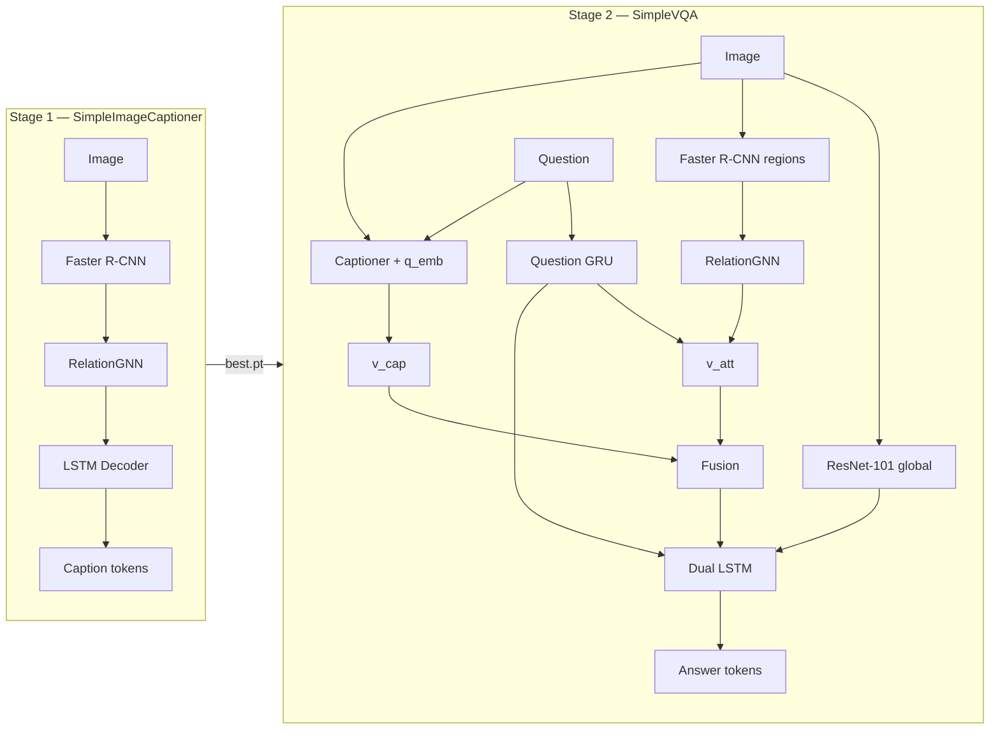
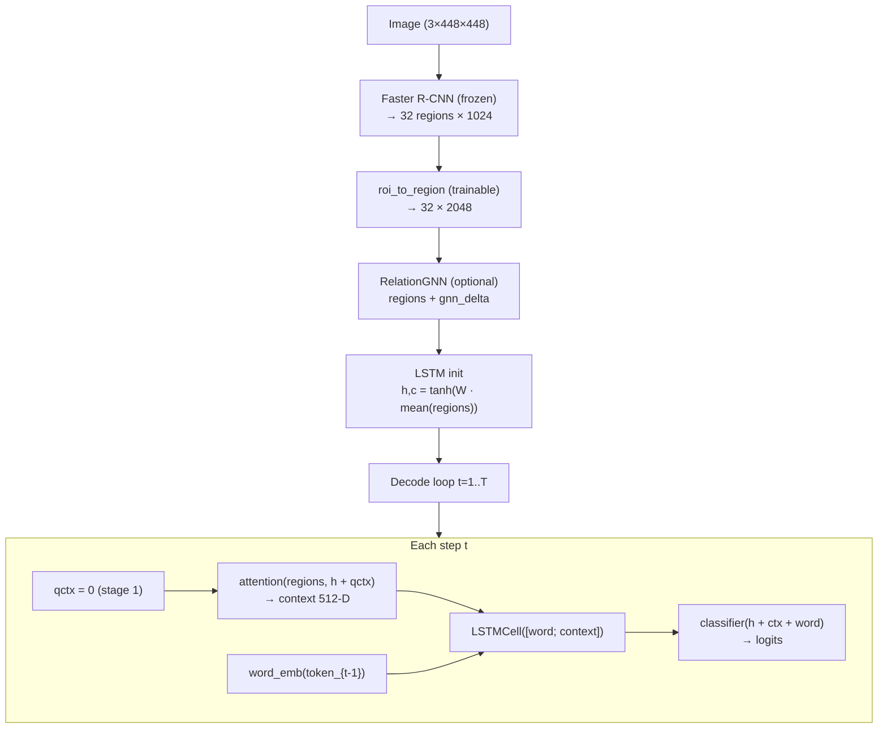
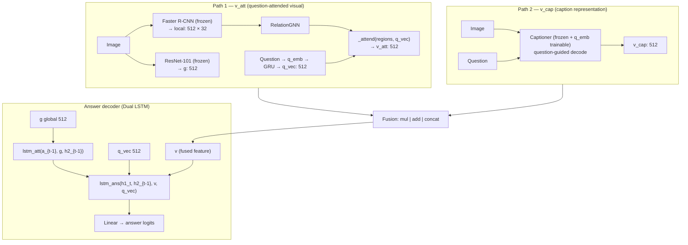

# Architecture — SimpleImageCaptioner & SimpleVQA

<!--
  This document describes the architecture of both models.
  Reference: Sharma & Jalal (2021) — Image captioning improved visual question answering.
  Stage 1 = captioner | Stage 2 = VQA with loaded captioner.
-->

## Overview

<!--
  Two-stage pipeline: first train the captioner, then VQA with it.
  Stage 1 trains on MSCOCO captions (no questions).
  Stage 2 trains on VQA v2 and loads the captioner checkpoint.
-->

| Stage | Project | Data | Output |
|-------|---------|------|--------|
| **1** | `SimpleImageCaptioner/` | MSCOCO captions | Caption for image |
| **2** | `SimpleVQA/` | VQA v2 (question + answer) | Answer for (image, question) |



---

## Stage 1 — SimpleImageCaptioner

<!--
  Main model: SimpleImageCaptioner in captioner_v1.py
  Training: SimpleImageCaptioner/train.py
  Each decode step uses attention over 32 regions.
-->

### Goal

Stage 1 learns **image → caption** only. No question is fed (`question_ids=None`).

### Pipeline



### Components

| Layer | File | Trainable? | Input → Output |
|-------|------|------------|----------------|
| `RegionEncoder` | `captioner_v1.py` | `roi_to_region` only | Image → `(N, 32, 2048)` |
| `RelationGNN` | `relation_gnn.py` | Yes | `(N,32,2048)` → `(N,32,2048)` residual |
| `RegionAttention` | `captioner_v1.py` | Yes | regions + `h_{t-1}` → context 512 |
| `word_emb` | `captioner_v1.py` | Yes | token id → 512 |
| `LSTMCell` | `captioner_v1.py` | Yes | `[word; context]` → `h_t` 512 |
| `classifier` | `captioner_v1.py` | Yes | hidden → vocab logits |

<!--
  RegionAttention: projects h and each region to 512,
  softmax over 32 regions, weighted sum → 2048, then ctx_proj → 512.
-->

### Decode (inference)

| Mode | Function | Description |
|------|----------|-------------|
| Greedy | `_decode_caption()` | Argmax at each step |
| Beam | `generate_caption()` | beam=5, length-norm, trigram blocking |

### Dimensions (paper-aligned defaults)

| Symbol | Size | Description |
|--------|------|-------------|
| K (regions) | 32 | ROIs from Faster R-CNN |
| L (region dim) | 2048 | `v_i ∈ ℝ^2048` |
| LSTM hidden | 512 | `h_t`, `m_t` |
| word_dim | 512 | caption word embeddings |
| embed_dim | 512 | attention working space |
| max_caption_len | 20 | + BOS/EOS |

### Training (Stage 1)

```
Input:  (image, caption_ids GT)
Loss:   CrossEntropy on caption_ids[:, 1:]
Mode:   Teacher forcing (+ optional scheduled sampling)
Output: outputs/<run>/best.pt  (model + vocab)
```

**Special tokens:** PAD=0, BOS=1, EOS=2

---

## Stage 2 — SimpleVQA (VQAModel)

<!--
  VQAModel lives in SimpleVQA/train.py.
  Captioner is loaded from Stage 1; only q_emb/q_proj are trainable.
  Two LSTMs for answers: lstm_att + lstm_ans.
-->

### Goal

For each `(image, question)`, produce an **answer**. The captioner helps build `v_cap`.

### Pipeline — two visual paths



### Components — VQAModel

| Module | Trainable? | Input → Output |
|--------|------------|----------------|
| `resnet` + `g_proj` | g_proj only | Image → `g` (512) |
| `detector` + `local_proj` | local_proj only | Image → `(N,32,512)` |
| `q_emb`, `q_gru`, `q_proj` | Yes | question ids → `q_vec` (512) |
| `gnn` (RelationGNN) | Yes | regions → updated regions |
| `_attend` | Yes | regions + q_vec → `v_att` (512) |
| `captioner` | q_emb (+ q_proj) | image + q → caption → `v_cap` |
| `lstm_att`, `lstm_ans`, `out` | Yes | → answer logits |

<!--
  Important: VQA has two separate q_emb modules!
  1) VQAModel.q_emb → for v_att and answer LSTM
  2) captioner.q_emb → for question-guided caption
  They use separate vocabularies and are trained separately.
-->

### Caption integration

Captioner is loaded from `SimpleImageCaptioner/outputs/.../best.pt`:

| Captioner part | Stage 2 status |
|----------------|----------------|
| `word_emb`, LSTM, attention, classifier, GNN | **Frozen** |
| `q_emb`, `q_proj` | **Trainable** (random init, from answer loss) |

**Question conditioning in captioner:**

```
qctx = mean_pool(q_emb(question_ids)) → q_proj   # (512)
attention_query = h_{t-1} + qctx                  # every decode step
```

### v_cap — two modes (`caption_repr`)

| Mode | Train | Eval | Gradient to q_emb? |
|------|-------|------|---------------------|
| `hidden` | Mean LSTM hidden (EOS-masked) | mean word_emb(tokens) | Yes (train) |
| `text` | Greedy tokens → `cap_txt_gru` | same | No (caption decode no_grad) |

<!--
  For question-aware caption training, caption_repr: hidden is preferred.
  hidden mode: grad path answer_loss → v_cap → h → qctx → q_emb.
-->

### Fusion (`fuse_mode`)

| Mode | Formula | `v` dimension |
|------|---------|---------------|
| `mul` | `v = v_cap ⊙ v_att` | 512 |
| `add` | `v = v_cap + v_att` | 512 |
| `concat` | `v = [v_cap ; v_att]` | 1024 |

### Answer decoder (Dual LSTM)

**Paper Eq. 10 — Attention LSTM:**
```
h1_t = LSTM_att( a_emb(a_{t-1}), g, h2_{t-1} )
```

**Paper Eq. 13 — Answer LSTM:**
```
h2_t = LSTM_ans( h1_t, h2_{t-1}, v, q_vec )
logit_t = Linear(h2_t)
```

<!--
  q_vec is fed directly into lstm_ans (not only via v_att).
  This was important for overfitting on small sample counts.
-->

### Dimensions — VQA

| Key | Default | Description |
|-----|---------|-------------|
| `hidden_dim` | 512 | LSTM, projections |
| `word_dim` | 512 | q/a embeddings |
| `question_dim` | 1280 | GRU hidden |
| `max_regions` | 32 | ROI count |
| `max_question_len` | 14 | + BOS/EOS |
| `max_answer_len` | 6 | + BOS/EOS |

### Training (Stage 2)

```
Input:  (image, question_ids, answer_ids GT)
Loss:   CrossEntropy on answer_ids[:, 1:]
Metric: VQA v2 soft accuracy
Output: outputs/<run>/best.pt  (VQAModel + q_vocab + a_vocab + captioner.q_emb)
```

---

## Separate vocabularies (important!)

<!--
  Common mistake: mixing caption vocab and question vocab.
  word_emb captioner ≠ q_emb VQA ≠ q_emb captioner.
-->

| Embedding | Vocab | Size (smoke) | Used in |
|-----------|-------|--------------|---------|
| `captioner.word_emb` | MSCOCO caption | ~9906 | Caption decode |
| `captioner.q_emb` | VQA question | ~7650 | Caption question bias |
| `VQAModel.q_emb` | VQA question | ~7650 | v_att + answer LSTM |
| `VQAModel.a_emb` | VQA answer | ~12964 | Answer decode |

---

## File map

```
src/
├── architecture/
│   ├── ARCHITECTURE.en.md       English (this file)
│   └── ARCHITECTURE.fa.md       Finglish / Persian-English
├── SimpleImageCaptioner/
│   ├── train.py                 Stage 1 training
│   ├── eval.py                  Caption inference / demo
│   ├── models/
│   │   ├── captioner_v1.py      SimpleImageCaptioner (main)
│   │   ├── relation_gnn.py      GNN for captioner
│   │   └── base_captioner.py    Interface
│   └── configs/smoke.yaml
│
└── SimpleVQA/
    ├── train.py                 Stage 2 training + VQAModel
    ├── eval.py                  VQA inference / accuracy
    ├── diagnose_caption_q.py    Test: does question change caption?
    └── configs/smoke.yaml
```

---

## Workflow — train to eval

```bash
# 1) Stage 1
cd SimpleImageCaptioner
python train.py --config configs/smoke.yaml

# 2) Stage 2 (set captioner_ckpt in yaml)
cd ../SimpleVQA
python train.py --config configs/smoke.yaml

# 3) Eval VQA
python eval.py --config configs/smoke.yaml --ckpt outputs/smoke/best.pt --split val --samples 20

# 4) Eval question-guided caption
cd ../SimpleImageCaptioner
python eval.py --config configs/smoke.yaml --ckpt outputs/smoke/best.pt \
  --vqa-ckpt ../SimpleVQA/outputs/smoke/best.pt \
  --image-id 25 --split train --question "How many animals are in this photo?"
```

---

## Feature caching (faster training)

<!--
  Region and global features are saved once so each epoch
  does not re-run Faster R-CNN / ResNet.
-->

| Cache | Project | Path pattern | Content |
|-------|---------|--------------|---------|
| Region (captioner) | SimpleImageCaptioner | `{image_id}.pt` | raw ROI 1024-D |
| Region (VQA) | SimpleVQA | `{image_id}_k32_raw1024.pt` | raw ROI 1024-D |
| Global (VQA) | SimpleVQA | `{image_id}.pt` | ResNet 2048-D |

---

## References

- Sharma & Jalal (2021) — *Image captioning improved visual question answering*
- Xu et al. (2015) — Show, Attend and Tell (attention + LSTM init)
- VQA v2 dataset — Open-ended questions + 10 annotator answers
