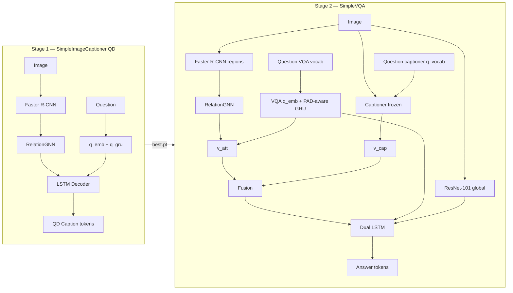
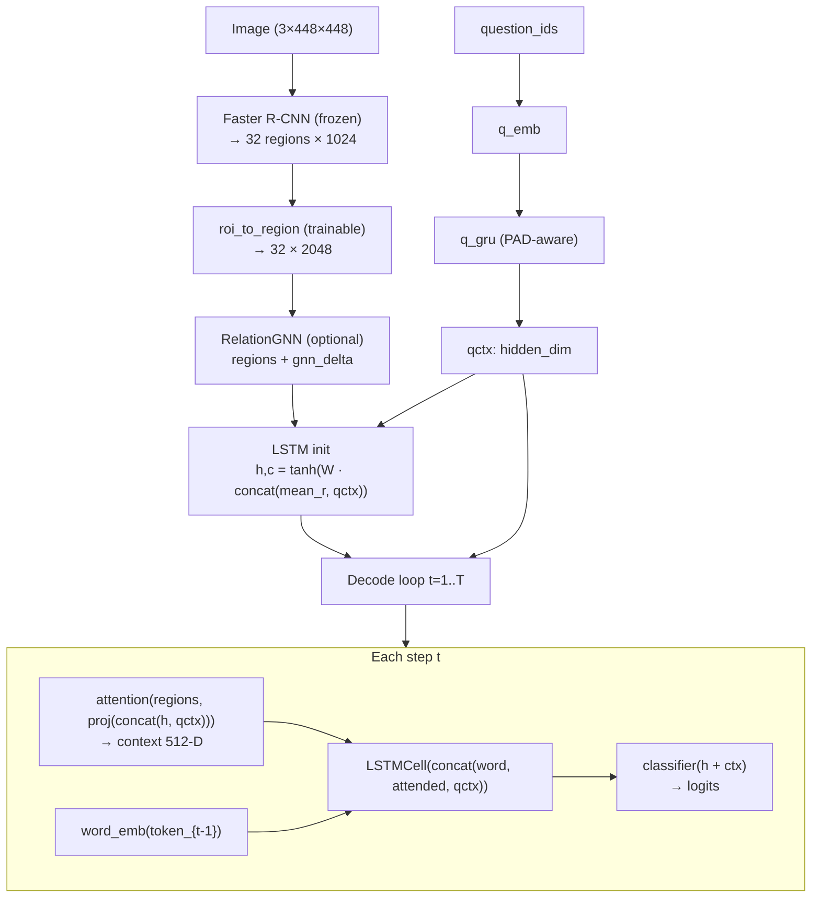
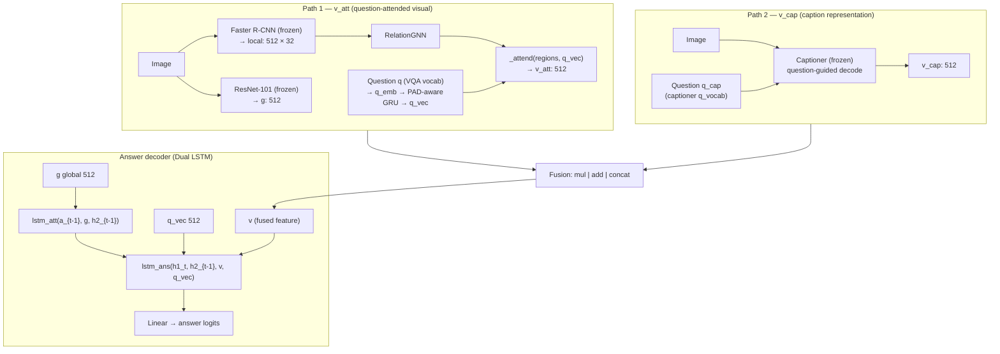

# Architecture — SimpleImageCaptioner & SimpleVQA

<!--
  This document describes the architecture of both models.
  Reference: Sharma & Jalal (2021) — Image captioning improved visual question answering.
  Stage 1 = captioner | Stage 2 = VQA with loaded captioner.
-->

## Overview

<!--
  Two-stage pipeline: first train the captioner, then VQA with it.
  Stage 1 trains on MSCOCO captions (no questions).
  Stage 2 trains on VQA v2 and loads the captioner checkpoint.
-->

| Stage | Project | Data | Output |
|-------|---------|------|--------|
| **1** | `SimpleImageCaptioner/` | QD captions `(image, question, caption)` — or legacy MSCOCO | Question-dependent caption |
| **2** | `SimpleVQA/` | VQA v2 (question + answer) | Answer for (image, question) |



---

## Stage 1 — SimpleImageCaptioner

<!--
  Main model: SimpleImageCaptioner in captioner_v1.py
  Training: SimpleImageCaptioner/train.py
  QD mode: dataset_mode=qd → (image, question, caption) from VQA rule-based JSON.
-->

### Goal

Stage 1 (QD, default path): learn **(image, question) → question-dependent caption**.

Legacy MSCOCO path (`dataset_mode: coco`) still supported with `qctx=0`.

### Pipeline (QD)



### Components

| Layer | File | Trainable? | Input → Output |
|-------|------|------------|----------------|
| `RegionEncoder` | `captioner_v1.py` | `roi_to_region` only | Image → `(N, 32, 2048)` |
| `RelationGNN` | `relation_gnn.py` | Yes | `(N,32,2048)` → `(N,32,2048)` residual |
| `RegionAttention` | `captioner_v1.py` | Yes | regions + `proj([h;qctx])` → context 512 |
| `attn_query_proj` | `captioner_v1.py` | Yes | `[h; qctx]` 1024 → query 512 |
| `region_init_h/c` | `captioner_v1.py` | Yes | `concat(mean_r, qctx)` → `h0,c0` 512 |
| `word_emb` | `captioner_v1.py` | Yes | caption token id → 512 |
| `q_emb` + `q_gru` | `captioner_v1.py` | Yes (QD) | question ids → `qctx` 512 |
| `LSTMCell` | `captioner_v1.py` | Yes | `[word; attended; qctx]` → `h_t` 512 |
| `classifier` | `captioner_v1.py` | Yes | hidden → vocab logits |

### Decode (inference)

| Mode | Function | Description |
|------|----------|-------------|
| Greedy | `_decode_caption()` | Argmax at each step |
| Beam | `generate_caption()` | beam=5, length-norm, trigram blocking |

### Dimensions (paper-aligned defaults)

| Symbol | Size | Description |
|--------|------|-------------|
| K (regions) | 32 | ROIs from Faster R-CNN |
| L (region dim) | 2048 | `v_i ∈ ℝ^2048` |
| LSTM hidden | 512 | `h_t`, `m_t` |
| word_dim | 512 | caption word embeddings |
| embed_dim | 512 | attention working space |
| max_caption_len | 20 | + BOS/EOS |
| max_question_len | 14 | + BOS/EOS |

### Training (Stage 1 — QD)

```
Input:  (image, question_ids, caption_ids GT)
Loss:   CrossEntropy on caption_ids[:, 1:]
Mode:   Teacher forcing (+ optional scheduled sampling)
Config: configs/default.yaml
Output: outputs/qd_*/best.pt  (model + vocab + q_vocab)
```

**Special tokens:** PAD=0, BOS=1, EOS=2

---

## Stage 2 — SimpleVQA (VQAModel)

<!--
  VQAModel lives in SimpleVQA/train.py.
  Captioner is loaded from QD Stage 1; default ``captioner_finetune_q: false`` freezes all
  captioner weights (q_emb/q_gru already trained in Stage 1).
  VQA uses two question encodings: q (VQA vocab) and q_cap (captioner q_vocab).
  Two LSTMs for answers: lstm_att + lstm_ans.
-->

### Goal

For each `(image, question)`, produce an **answer**. The captioner helps build `v_cap`.

### Pipeline — two visual paths



### Components — VQAModel

| Module | Trainable? | Input → Output |
|--------|------------|----------------|
| `resnet` + `g_proj` | g_proj only | Image → `g` (512) |
| `detector` + `local_proj` | local_proj only | Image → `(N,32,512)` |
| `q_emb`, `q_gru`, `q_proj` | Yes | VQA `q` ids → PAD-aware GRU → `q_vec` (512) |
| `gnn` (RelationGNN) | Yes | regions → updated regions |
| `_attend` | Yes | regions + q_vec → `v_att` (512) |
| `captioner` | Frozen (default) | image + `q_cap` → `v_cap` |
| `lstm_att`, `lstm_ans`, `out` | Yes | EOS-masked CE loss → answer logits |

<!--
  Important: VQA has TWO question encodings and THREE embedding tables for text!
  1) VQAModel.q_emb + q_gru  → input q (VQA q_vocab from train QIDs)
  2) captioner.q_emb + q_gru → input q_cap (captioner q_vocab from Stage-1 ckpt)
  3) captioner.word_emb      → caption tokens only
  a_vocab is also built from train QIDs only (critical for smoke / capped runs).
-->

### Caption integration

Captioner is loaded from `SimpleImageCaptioner/outputs/qd_*/best.pt`:

| Captioner part | Stage 2 status (default) |
|----------------|--------------------------|
| All captioner weights incl. `q_emb`, `q_gru` | **Frozen** (`captioner_finetune_q: false`) |
| Optional fine-tune | Set `captioner_finetune_q: true` → unfreeze `q_emb`, `q_gru` |

**Question conditioning in captioner (QD Stage 1):**

```
qctx = q_gru(q_emb(q_cap))   # PAD-aware last state
h0, c0 = tanh(W · concat(mean(regions), qctx))   # QD LSTM init
attention_query = attn_query_proj([h_{t-1}; qctx])   # concat then Linear 1024→512
LSTM input = [word; attended; qctx]
```

### v_cap — two modes (`caption_repr`)

| Mode | Train | Eval | Gradient to q_emb? |
|------|-------|------|---------------------|
| `hidden` | Mean LSTM hidden (EOS-masked) | mean word_emb(tokens) | Yes (train) |
| `text` | Greedy tokens → `cap_txt_gru` | same | No (caption decode no_grad) |

<!--
  For question-aware caption training, caption_repr: hidden is preferred.
  hidden mode: grad path answer_loss → v_cap → h → qctx → q_emb.
-->

### Fusion (`fuse_mode`)

| Mode | Formula | `v` dimension |
|------|---------|---------------|
| `mul` | `v = v_cap ⊙ v_att` | 512 |
| `add` | `v = v_cap + v_att` | 512 |
| `concat` | `v = [v_cap ; v_att]` | 1024 |

### Answer decoder (Dual LSTM)

**Paper Eq. 10 — Attention LSTM:**
```
h1_t = LSTM_att( a_emb(a_{t-1}), g, h2_{t-1} )
```

**Paper Eq. 13 — Answer LSTM:**
```
h2_t = LSTM_ans( h1_t, h2_{t-1}, v, q_vec )
logit_t = Linear(h2_t)
```

**Training / inference details:**
- Decoder steps = tokens until EOS (inclusive); no loss on PAD tail (`answer_step_lengths`)
- Teacher forcing: after EOS, next input is EOS (not PAD)
- Greedy eval: `decode_answer_ids()` stops at EOS for VQA v2 soft accuracy
- `q_vec` is fed directly into `lstm_ans` (not only via `v_att`)

### Dimensions — VQA

| Key | Default | Description |
|-----|---------|-------------|
| `hidden_dim` | 512 | LSTM, projections |
| `word_dim` | 512 | q/a embeddings |
| `question_dim` | 1280 | GRU hidden |
| `max_regions` | 32 | ROI count |
| `max_question_len` | 14 | + BOS/EOS |
| `max_answer_len` | 6 | + BOS/EOS |

### Training (Stage 2)

```
Input:  (image, q, q_cap, answer_ids GT)
        q      = VQA question encoding (q_vocab from train QIDs)
        q_cap  = captioner question encoding (q_vocab from Stage-1 ckpt)
Loss:   CrossEntropy on answer tokens up to EOS (PAD positions masked)
Metric: VQA v2 soft accuracy (greedy decode at validation)
Output: outputs/<run>/best.pt  (VQAModel + q_vocab + a_vocab)
```

`eval.py` loads the same vocabs from checkpoint and passes `q_cap_ids` like training.

---

## Separate vocabularies (important!)

<!--
  Common mistakes:
  - Building a_vocab from full VQA train while using max_train_qids (smoke)
  - Feeding VQA q into captioner instead of q_cap
  - Decoding answers without stopping at EOS
-->

| Embedding / ids | Vocab source | Size (smoke 100 QIDs) | Used in |
|-----------------|--------------|------------------------|---------|
| `captioner.word_emb` | Caption `vocab` in ckpt | ~163 | Caption decode |
| `captioner.q_emb` | `q_vocab` in captioner ckpt | ~140 | `q_cap` → `v_cap` |
| `VQAModel.q_emb` | `q_vocab` in VQA ckpt (train QIDs) | ~28 | `v_att`, answer LSTM |
| `VQAModel.a_emb` | `a_vocab` in VQA ckpt (train QIDs) | ~60 | Answer decode |

Full `default.yaml` run: vocabs cover all train QIDs (thousands of question tokens, ~13k answer types before freq filter).

---

## File map

```
src/
├── architecture/
│   ├── ARCHITECTURE.en.md       English (this file)
│   └── ARCHITECTURE.fa.md       Finglish / Persian-English
├── SimpleImageCaptioner/
│   ├── train.py                 Stage 1 training
│   ├── eval.py                  Caption inference / demo
│   ├── models/
│   │   ├── captioner_v1.py      SimpleImageCaptioner (main)
│   │   ├── relation_gnn.py      GNN for captioner
│   │   └── base_captioner.py    Interface
│   └── configs/smoke.yaml, default.yaml
│
└── SimpleVQA/
    ├── train.py                 Stage 2 training + VQAModel
    ├── eval.py                  VQA inference (q_cap, greedy acc, samples)
    └── configs/smoke.yaml       → captioner outputs/smoke/best.pt
```

---

## Workflow — train to eval

```bash
# 1) Stage 1 — QD captioner
cd SimpleImageCaptioner
python train.py --config configs/smoke.yaml

# 2) Stage 2 (captioner_ckpt → outputs/smoke/best.pt in smoke.yaml)
cd ../SimpleVQA
python train.py --config configs/smoke.yaml

# 3) Eval VQA (greedy acc + samples; uses q_cap)
python eval.py --config configs/smoke.yaml --ckpt outputs/smoke/best.pt --split train --samples 20

# 4) Eval QD caption
cd ../SimpleImageCaptioner
python eval.py --config configs/smoke.yaml --ckpt outputs/smoke/best.pt \
  --image-id 25 --split train --question "How many animals are in this photo?"
```

---

## Feature caching (faster training)

<!--
  Region and global features are saved once so each epoch
  does not re-run Faster R-CNN / ResNet.
-->

| Cache | Project | Path pattern | Content |
|-------|---------|--------------|---------|
| Region (captioner) | SimpleImageCaptioner | `{image_id}.pt` | raw ROI 1024-D |
| Region (VQA) | SimpleVQA | `{image_id}_k32_raw1024.pt` | raw ROI 1024-D |
| Global (VQA) | SimpleVQA | `{image_id}.pt` | ResNet 2048-D |

---

## References

- Sharma & Jalal (2021) — *Image captioning improved visual question answering*
- Xu et al. (2015) — Show, Attend and Tell (attention + LSTM init)
- VQA v2 dataset — Open-ended questions + 10 annotator answers
