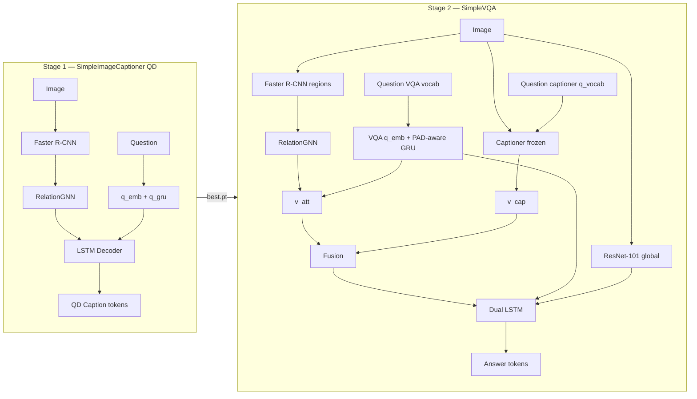
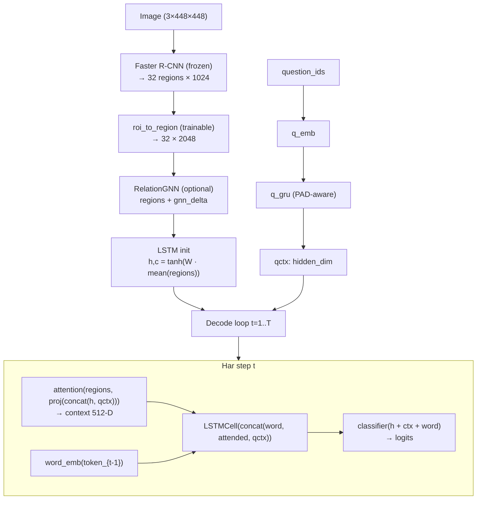
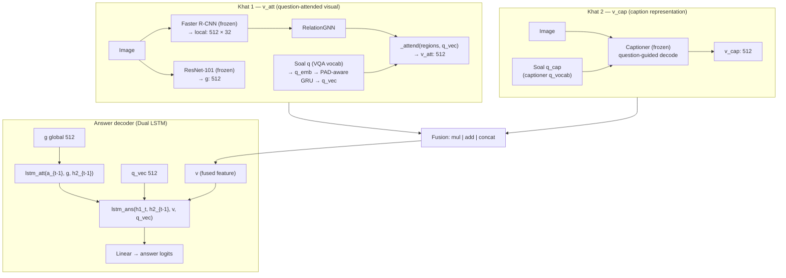

# Architecture — SimpleImageCaptioner & SimpleVQA

<!--
  In file architecture-e do model ro ba Finglish tozih mide.
  Marja: Sharma & Jalal (2021) — Image captioning improved visual question answering.
  Stage 1 = captioner | Stage 2 = VQA ba captioner-e load shode.
-->

## Kholase (Overview)

<!--
  Do marhale: Stage 1 QD caption (image+soal→caption), Stage 2 VQA.
-->

| Marhale | Project | Data | Khoroji |
|---------|---------|------|---------|
| **1** | `SimpleImageCaptioner/` | QD captions `(image, question, caption)` — ya MSCOCO legacy | Caption question-dependent |
| **2** | `SimpleVQA/` | VQA v2 (soal + javab) | Javab baraye (tasvir, soal) |



---

## Stage 1 — SimpleImageCaptioner

<!--
  Model asli: SimpleImageCaptioner dar captioner_v1.py
  QD mode: dataset_mode=qd → (image, question, caption).
-->

### Hadaf

Marhale 1 (QD): **(image, question) → question-dependent caption**.
Path legacy MSCOCO (`dataset_mode: coco`) ba `qctx=0` hanuz kar mikone.

### Pipeline (QD)



### Component-ha

| Layer | File | Trainable? | Voroudi → Khorouji |
|-------|------|------------|---------------------|
| `RegionEncoder` | `captioner_v1.py` | `roi_to_region` only | Image → `(N, 32, 2048)` |
| `RelationGNN` | `relation_gnn.py` | Yes | `(N,32,2048)` → `(N,32,2048)` residual |
| `RegionAttention` | `captioner_v1.py` | Yes | regions + `proj([h;qctx])` → context 512 |
| `attn_query_proj` | `captioner_v1.py` | Yes | `[h; qctx]` 1024 → query 512 |
| `word_emb` | `captioner_v1.py` | Yes | caption token → 512 |
| `q_emb` + `q_gru` | `captioner_v1.py` | Yes (QD) | question ids → `qctx` 512 |
| `LSTMCell` | `captioner_v1.py` | Yes | `[word; attended; qctx]` → `h_t` 512 |
| `classifier` | `captioner_v1.py` | Yes | hidden → vocab logits |

### Decode (inference)

| Mode | Function | Tozih |
|------|----------|-------|
| Greedy | `_decode_caption()` | Har step argmax |
| Beam | `generate_caption()` | beam=5, length-norm, trigram block |

### Abaad (Paper-aligned defaults)

| Symbol | Size | Tozih |
|--------|------|-------|
| K (regions) | 32 | ROI az Faster R-CNN |
| L (region dim) | 2048 | `v_i ∈ ℝ^2048` |
| LSTM hidden | 512 | `h_t`, `m_t` |
| word_dim | 512 | embedding kalamat caption |
| embed_dim | 512 | working space attention |
| max_caption_len | 20 | + BOS/EOS |
| max_question_len | 14 | + BOS/EOS |

### Train (Stage 1 — QD)

```
Input:  (image, question_ids, caption_ids GT)
Loss:   CrossEntropy roye caption_ids[:, 1:]
Mode:   Teacher forcing (+ optional scheduled sampling)
Config: configs/default.yaml
Output: outputs/qd_*/best.pt  (model + vocab + q_vocab)
```

**Special tokens:** PAD=0, BOS=1, EOS=2

---

## Stage 2 — SimpleVQA (VQAModel)

<!--
  VQAModel dar SimpleVQA/train.py hast.
  Captioner az QD Stage 1 load mishe; default ``captioner_finetune_q: false`` = freeze hame
  (q_emb/q_gru ghablan dar Stage 1 train shodan).
  VQA do encoding soal dare: q (VQA vocab) va q_cap (captioner q_vocab).
  Do LSTM baraye javab: lstm_att + lstm_ans.
-->

### Hadaf

Baraye har `(image, question)` yek **javab** tolid kon. Captioner komak mikone ta `v_cap` besazim.

### Pipeline — do khat visual



### Component-ha — VQAModel

| Module | Trainable? | Voroudi → Khorouji |
|--------|------------|---------------------|
| `resnet` + `g_proj` | g_proj only | Image → `g` (512) |
| `detector` + `local_proj` | local_proj only | Image → `(N,32,512)` |
| `q_emb`, `q_gru`, `q_proj` | Yes | VQA `q` → GRU PAD-aware → `q_vec` (512) |
| `gnn` (RelationGNN) | Yes | regions → updated regions |
| `_attend` | Yes | regions + q_vec → `v_att` (512) |
| `captioner` | Frozen (default) | image + `q_cap` → `v_cap` |
| `lstm_att`, `lstm_ans`, `out` | Yes | CE ba EOS-mask → answer logits |

<!--
  Mohem: VQA do encoding soal + se ta embedding matni dare!
  1) VQAModel.q_emb + q_gru  → voroudi q (VQA q_vocab az train QIDs)
  2) captioner.q_emb + q_gru → voroudi q_cap (captioner q_vocab az Stage-1 ckpt)
  3) captioner.word_emb      → faghat token haye caption
  a_vocab ham faghat az train QIDs sakhte mishe (baraye smoke/cap zaruri).
-->

### Caption integration

Captioner az `SimpleImageCaptioner/outputs/qd_*/best.pt` load mishe:

| Captioner part | Stage 2 (default) |
|----------------|-------------------|
| Hame weight ha incl. `q_emb`, `q_gru` | **Frozen** (`captioner_finetune_q: false`) |
| Fine-tune ixtiyari | `captioner_finetune_q: true` → unfreeze `q_emb`, `q_gru` |

**Question conditioning dar captioner (QD Stage 1):**

```
qctx = q_gru(q_emb(q_cap))   # PAD-aware last state
attention_query = attn_query_proj([h_{t-1}; qctx])   # concat then Linear 1024→512
LSTM input = [word; attended; qctx]
```

### v_cap — do halat (`caption_repr`)

| Mode | Train | Eval | Gradient be q_emb? |
|------|-------|------|---------------------|
| `hidden` | Mean LSTM hidden (EOS-masked) | mean word_emb(tokens) | Yes (train) |
| `text` | Greedy tokens → `cap_txt_gru` | same | No (caption decode no_grad) |

<!--
  Baraye question-aware caption train, caption_repr: hidden behtar ast.
  hidden mode: grad az answer_loss → v_cap → h → qctx → q_emb.
-->

### Fusion (`fuse_mode`)

| Mode | Formula | `v` dimension |
|------|---------|---------------|
| `mul` | `v = v_cap ⊙ v_att` | 512 |
| `add` | `v = v_cap + v_att` | 512 |
| `concat` | `v = [v_cap ; v_att]` | 1024 |

### Answer decoder (Dual LSTM)

**Paper Eq. 10 — Attention LSTM:**
```
h1_t = LSTM_att( a_emb(a_{t-1}), g, h2_{t-1} )
```

**Paper Eq. 13 — Answer LSTM:**
```
h2_t = LSTM_ans( h1_t, h2_{t-1}, v, q_vec )
logit_t = Linear(h2_t)
```

**Joziyat train / inference:**
- Decoder steps = token ha ta EOS (shamel); loss roye PAD tail nist (`answer_step_lengths`)
- Teacher forcing: baad EOS, voroudi badi EOS (na PAD)
- Greedy eval: `decode_answer_ids()` dar EOS stop mikone
- `q_vec` mostaghim vared `lstm_ans` mishe (na faghat az tarigh `v_att`)

### Abaad — VQA

| Key | Default | Tozih |
|-----|---------|-------|
| `hidden_dim` | 512 | LSTM, projections |
| `word_dim` | 512 | q/a embeddings |
| `question_dim` | 1280 | GRU hidden |
| `max_regions` | 32 | ROI count |
| `max_question_len` | 14 | + BOS/EOS |
| `max_answer_len` | 6 | + BOS/EOS |

### Train (Stage 2)

```
Input:  (image, q, q_cap, answer_ids GT)
        q      = encoding soal VQA (q_vocab az train QIDs)
        q_cap  = encoding soal captioner (q_vocab az Stage-1 ckpt)
Loss:   CrossEntropy ta EOS (PAD mask shode)
Metric: VQA v2 soft accuracy (greedy dar validation)
Output: outputs/<run>/best.pt  (VQAModel + q_vocab + a_vocab)
```

`eval.py` hamun vocab ha va `q_cap_ids` ro mesl train estefade mikone.

---

## Do Vocabulary joda (mohem!)

<!--
  Ehtemal shtebah:
  - a_vocab az kol train VQA ba max_train_qids (smoke)
  - VQA q be captioner dadan be jaye q_cap
  - decode javab bedoon stop dar EOS
-->

| Embedding / ids | Manba vocab | Size (smoke 100 QID) | Koja |
|-----------------|-------------|----------------------|------|
| `captioner.word_emb` | `vocab` dar ckpt caption | ~163 | decode caption |
| `captioner.q_emb` | `q_vocab` dar ckpt captioner | ~140 | `q_cap` → `v_cap` |
| `VQAModel.q_emb` | `q_vocab` dar ckpt VQA (train QIDs) | ~28 | `v_att`, answer LSTM |
| `VQAModel.a_emb` | `a_vocab` dar ckpt VQA (train QIDs) | ~60 | decode javab |

Run `default.yaml`: vocab ha roye hame train QIDs (hezar ha soal, ~13k javab ghabl az freq filter).

---

## File map

```
src/
├── architecture/
│   ├── ARCHITECTURE.en.md       English
│   └── ARCHITECTURE.fa.md       Finglish (in file)
├── SimpleImageCaptioner/
│   ├── train.py                 Stage 1 training
│   ├── eval.py                  Caption inference / demo
│   ├── models/
│   │   ├── captioner_v1.py      SimpleImageCaptioner (asli)
│   │   ├── relation_gnn.py      GNN baraye captioner
│   │   └── base_captioner.py    Interface
│   └── configs/smoke.yaml, default.yaml
│
└── SimpleVQA/
    ├── train.py                 Stage 2 training + VQAModel
    ├── eval.py                  VQA inference (q_cap, greedy acc, samples)
    └── configs/smoke.yaml       → captioner outputs/smoke/best.pt
```

---

## Workflow — az train ta eval

```bash
# 1) Stage 1 — QD captioner
cd SimpleImageCaptioner
python train.py --config configs/smoke.yaml

# 2) Stage 2 (captioner_ckpt → outputs/smoke/best.pt dar smoke.yaml)
cd ../SimpleVQA
python train.py --config configs/smoke.yaml

# 3) Eval VQA (greedy acc + samples; ba q_cap)
python eval.py --config configs/smoke.yaml --ckpt outputs/smoke/best.pt --split train --samples 20

# 4) Eval caption QD
cd ../SimpleImageCaptioner
python eval.py --config configs/smoke.yaml --ckpt outputs/smoke/best.pt \
  --image-id 25 --split train --question "How many animals are in this photo?"
```

---

## Cache (sari tar shodan train)

<!--
  Region va global feature ro 1 bar save mikonim ta har epoch
  Faster R-CNN / ResNet dobare run nashe.
-->

| Cache | Project | Path pattern | Content |
|-------|---------|--------------|---------|
| Region (captioner) | SimpleImageCaptioner | `{image_id}.pt` | raw ROI 1024-D |
| Region (VQA) | SimpleVQA | `{image_id}_k32_raw1024.pt` | raw ROI 1024-D |
| Global (VQA) | SimpleVQA | `{image_id}.pt` | ResNet 2048-D |

---

## References

- Sharma & Jalal (2021) — *Image captioning improved visual question answering*
- Xu et al. (2015) — Show, Attend and Tell (attention + LSTM init)
- VQA v2 dataset — Open-ended questions + 10 annotator answers
